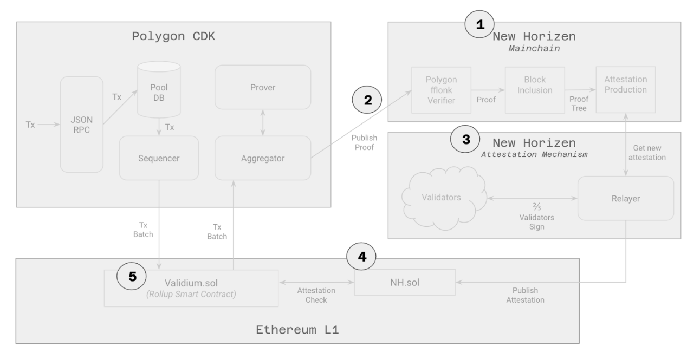

# zkVerify Proof Verification Chain

zkVerify is made of five core components that are defined below.

## Mainchain
This is an L1 Proof of Stake blockchain implemented as a Substrate Relay Chain. Its main responsibilities, besides exchanging $ZEN, the primary token of the chain, are to receive, verify, and store validity proofs.  It houses the verifier modules, such as the Fflonk native verifier.  In some other documents, this component may also be referred to as the Proof Verification Chain.

## Proof Submission Interface
This is the interface (i.e. transactions and RPC calls) used by clients (zk rollups and zkapps) to submit proofs to zkVerify for verification.

## Attestation Mechanism
The protocol that publishes the Merkle root of the proof tree onto the zkVerify smart contract on Ethereum once a given publication policy is met.

## zkVerify Smart Contract
The core responsibility of this smart contract (NewHorizenProofVerifier.sol) is to store new attestations, validate them, and provide capabilities for NH users to verify that their proof is part of the attestation.

## Proof Submitters
Users interested in verifying proofs on NH because:
 - It is cheaper than doing it on a given settlement layer (e.g. Ethereum).
 - For notarization/timestamping purposes.
