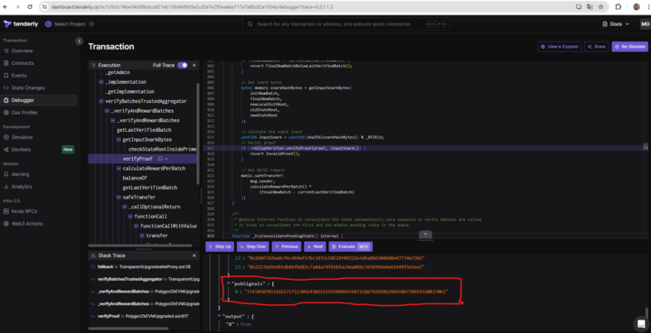
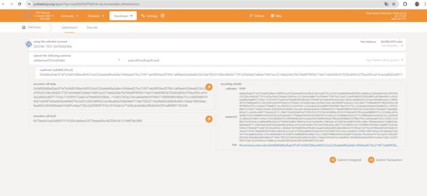

# How to submit a Polygon CDK proof
In this tutorial we'll go through the process of submitting and verifying a Polygon CDK proof to the ZkVerify chain.

## Requirements
- A Substrate compatible wallet with funds (nZEN) connected to the network
- A Polygon CDK (Fork_ID 6) FFLONK proof

## Step 1
Identify a `VerifyBatches` or `VerifyBatchesTrustedAggregator` transaction that is compatible with fork id 6.

It is possible to find the this kind of transaction at this [address](https://etherscan.io/address/0x5132a183e9f3cb7c848b0aac5ae0c4f0491b7ab2) (Polygon CDK Proxy contract).
According to this [releases document](https://docs.polygon.technology/zkEVM/get-started/historical-data/) the time range in which you can look for transactions is between November 2023 and January 2024.

For example:

https://etherscan.io/tx/0x5c74be04b086dccaf27e6138d468fd9a3cd3a7e295eaebe717a7a88c82a1054a

## Step 2
Gather the Public Input and the Proof using [Tenderly](https://tenderly.co/).

Replace your transaction ID in this URL: https://dashboard.tenderly.co/tx/1/YOUR_TRANSACTION_ID/debugger?trace=0.2.1.1.3

For example:

https://dashboard.tenderly.co/tx/1/0x5c74be04b086dccaf27e6138d468fd9a3cd3a7e295eaebe717a7a88c82a1054a/debugger?trace=0.2.1.1.3

From the bottom console copy the content of the field `proof` and remove all the junk characters to make it into a single line without `"` and `0x` (a part from the first).

In this example the value is: 

`0x0d6bd5ab3f7af7e3b85386ecfb0533ce522bde6df6a3e8e143bfea837bc21f471eb89036e28789c1a09edc62b4e44236c54d783c9129bc49d2b773f1c83efdaf23d6eb7b691ec227dafa2d0a7fa769a9f7f0f3b17de57c6b83802676382d063c070ba305cc41b3e2a88d2a0071735ac7135f59772a421d79ed020338b48c552b0f2a76d43e91aa3262c20facd688436c153aef69d0feda3c1403b397e79d8bd92317de13b55e263f95ab3f278ddcf2fe6d53abcd3d5e57e6ca4c68987e1e62cf1d728e773286a859f74b9345dc30499895e787cc3da627f8a057c2c4929311c414f63cc2d1b6eb121da00f918998278af23f79cc21bad9e24dbbd24a8653cc3617e00a72118a77e8d4cb4e4c158d245a910d0c22ac04c8aaeb9a44bc588b0593173be0930859f28322127eeb3b9c5de4a9716ae866863a7ccafe9cdd97714a2e21f7cf0ef31bb924d51b7f595f632727d67e9989ec953f57b82465f99ca5ed08093f3cf22104ce07e5a8bdfe22334084f43b5d3291145aa6dd27750daaf694182d5566f47ec8ee2113e860ae362cb77e7808dabb1edb92ce1ca265e43c20beeb15047ce9bc27421868d975c90940d018dfe1ada356540983562e7061ad4980e412f88e79bc1a5dbae07951c510171c805d75d7b2ebc3c00e689636d12f7494d310017058fa72e57a26d94c7605d2ce539074cb90d5f581c4b8c706d6da4d5c540b816a8e89da5f7c16834a6fa4514b5ab96ebbd6acdfdcd2934a8174c5e8769b164c202772156845c917234894f26f6b31a844731a53a599b3f3b4e4ffed07d519a3494cc30e8af29f668584e784d9c6ea6fed4bb685106108d3a75788de7aff1b34789a4491878d4bf23ba1f3758378db68fd532d62c0663e1f124c9f285ae8054226b2d327e55b0974157aec1ed96bc2f4817d07fdfdc3bfa64e4f3ad9e7f4110a01292dc334ca664e9bf2f19b071588808f8c906e731cc5883f4801943b142b0f7d2be8cf6c4b9ef57bc3d33c58526f09222e3dba8b620db08e47734e738322136d9e9b5db8bfbd83c7a8da74fb5bfac9ea069c3636966e6e61649f1e5ea7`

And the content of the field `pubSignal` (Public Input)

In this example the value is: `7315058703216217175130914302515542984993687218879295022989106778919310837061`

Convert it into a hexadecimal format to obtain: `102C2D2F58997310C191634E1A71B00CDC4DD6E28B5BB42587ED8F40F119C545`

The final step is to concatenate the proof and the Public Input into a single string.

`0x0d6bd5ab3f7af7e3b85386ecfb0533ce522bde6df6a3e8e143bfea837bc21f471eb89036e28789c1a09edc62b4e44236c54d783c9129bc49d2b773f1c83efdaf23d6eb7b691ec227dafa2d0a7fa769a9f7f0f3b17de57c6b83802676382d063c070ba305cc41b3e2a88d2a0071735ac7135f59772a421d79ed020338b48c552b0f2a76d43e91aa3262c20facd688436c153aef69d0feda3c1403b397e79d8bd92317de13b55e263f95ab3f278ddcf2fe6d53abcd3d5e57e6ca4c68987e1e62cf1d728e773286a859f74b9345dc30499895e787cc3da627f8a057c2c4929311c414f63cc2d1b6eb121da00f918998278af23f79cc21bad9e24dbbd24a8653cc3617e00a72118a77e8d4cb4e4c158d245a910d0c22ac04c8aaeb9a44bc588b0593173be0930859f28322127eeb3b9c5de4a9716ae866863a7ccafe9cdd97714a2e21f7cf0ef31bb924d51b7f595f632727d67e9989ec953f57b82465f99ca5ed08093f3cf22104ce07e5a8bdfe22334084f43b5d3291145aa6dd27750daaf694182d5566f47ec8ee2113e860ae362cb77e7808dabb1edb92ce1ca265e43c20beeb15047ce9bc27421868d975c90940d018dfe1ada356540983562e7061ad4980e412f88e79bc1a5dbae07951c510171c805d75d7b2ebc3c00e689636d12f7494d310017058fa72e57a26d94c7605d2ce539074cb90d5f581c4b8c706d6da4d5c540b816a8e89da5f7c16834a6fa4514b5ab96ebbd6acdfdcd2934a8174c5e8769b164c202772156845c917234894f26f6b31a844731a53a599b3f3b4e4ffed07d519a3494cc30e8af29f668584e784d9c6ea6fed4bb685106108d3a75788de7aff1b34789a4491878d4bf23ba1f3758378db68fd532d62c0663e1f124c9f285ae8054226b2d327e55b0974157aec1ed96bc2f4817d07fdfdc3bfa64e4f3ad9e7f4110a01292dc334ca664e9bf2f19b071588808f8c906e731cc5883f4801943b142b0f7d2be8cf6c4b9ef57bc3d33c58526f09222e3dba8b620db08e47734e738322136d9e9b5db8bfbd83c7a8da74fb5bfac9ea069c3636966e6e61649f1e5ea7102C2D2F58997310C191634E1A71B00CDC4DD6E28B5BB42587ED8F40F119C545`

## Step 3

Send the proof to ZkVerify chain.
In order to do this you can use [PolkadotJs](https://polkadot.js.org/apps/?rpc=wss%3A%2F%2Fnh-rpc.horizenlabs.io#/extrinsics).

- Select your account (you must have some tZEN)
- Choose the `settlementFFlonkPallet`
- Inside the field `rawProof` paste the string obtained from the previous step
- Click on `submitTransaction`

## Step 4

Check your transactino on the [ZkVerify Block Explorer](https://nh-explorer.horizenlabs.io/v0/extrinsic)!