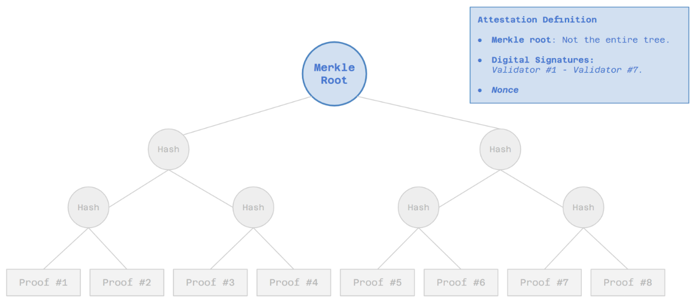
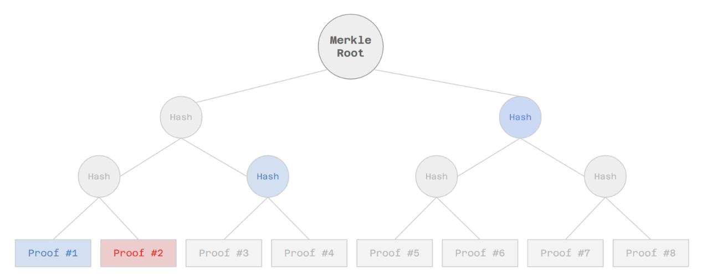
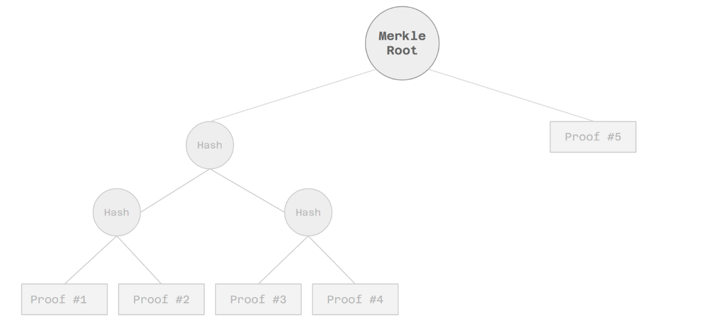

# Attestation Mechanism Data Structure

## Data Structure

The attestation data structure is a digitally-signed message that contains:
- **Merkle root** of a Merkle tree that contains proofs as leaves.
- **Digital signatures** of validators representing at least ⅔ of the total stake in zkVerify Mainchain.
- An **Attestation ID**. Used for identification, synchronization, and security purposes.

In order to prove that a given proof is part of the attestation, the user supplies a Merkle proof (path) leading from its proof to the Merkle root (attestation).

It is worth mentioning that Substrate employs a slightly optimized version of a Binary Merkle Tree, with the following (recursive) rule: if the number of nodes in the current level is not even, the odd node gets promoted to the upper level. To show it visually, let’s consider the previous tree and let’s assume only 5 proofs were present; normally, the number of leaves is padded to be a power of two and a tree would be produced. Instead, the one produced by Substrate, would look like the following:

This allows us to reduce the size of the tree and, more interestingly for us, reduces the size of the Merkle path for all the leaves with index between [2k , 2k-2], as a new level is added to the tree only when there are actual nodes available.
In order to decouple the Mainchain from Ethereum (the chain on which the attestation will be posted), the following assumptions are made:

- The **basic operations** done by the Mainchain consensus are:
    * Creation of a new attestation every time the conditions of a given policy are met.
    * Validators sign every attestation.
    * Storage and verification of proofs.

- zkVerify will provide different chains on which to send the attestation, and the users, when submitting a proof, will need to specify the destination chain. Note that:
    * We might envision different attestation publication policies for each destination chain, depending on different characteristics. Ideally, we would like this policy to change dynamically depending on how the destination chain changes (e.g. we might employ an oracle) and/or how many users are interested in bridging on that chain, instead of it being fixed since genesis and thus hardly changeable.
    * Users submitting proofs to NH will pay the fee required to perform basic operations plus the fee required to remunerate the relayer in order to post the proof on the destination chain (different for each chain).
