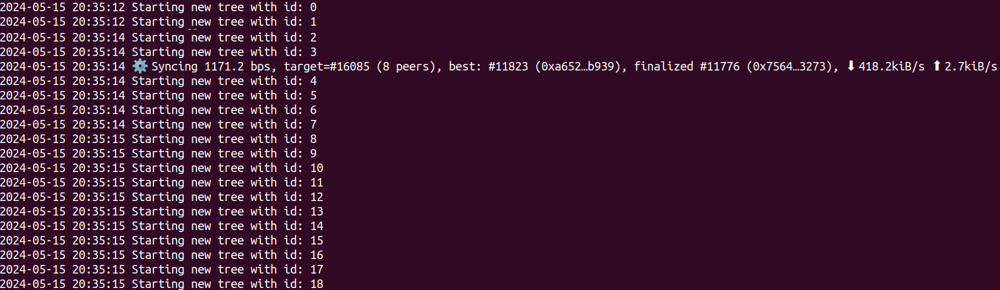
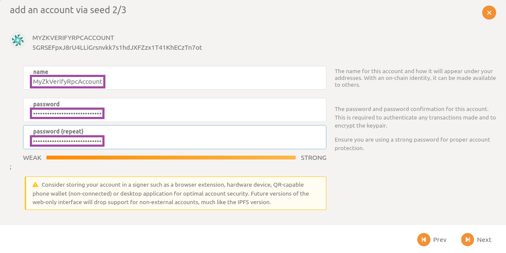
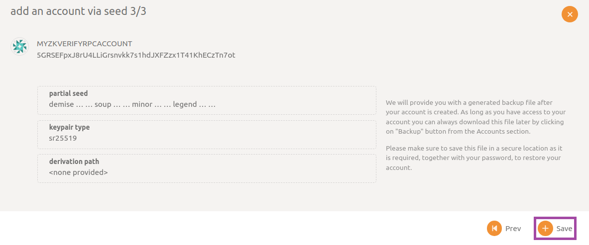

## Prepare the Environment

For running an RPC node open a terminal and navigate to the root directory of project `compose-zkverify-simplified`:

```bash
cd compose-zkverify-simplified
```

then launch the initialization script by typing:

```bash
scripts/init.sh
```

The interactive session run by the script asks you for providing input related to:

- node type: you need to select RPC node (refer to [this page](../01-chosing_the_node_type.md) for node types),
- network: currently only testnet is available,
- node name: just a human readable identifier,
- category of methods to expose: allows you to specify if you want to expose only safe methods (in case your machine is externally reachable) or every methods,
- archival feature: allows you to specify if you want to maintain a full or partial copy of the blockchain.

At the end of the session the script would populate directory `deployments/rpc-node/`*`network`* with the proper files and you would get a message similar to:

```bash
=== Run the compose project with the following command: 

========================
docker compose -f /home/your_user/compose-zkverify-simplified/deployments/rpc-node/testnet/docker-compose.yml up -d
========================
```

Before actually launching the node, you can further inspect and customize the execution by manually editing `deployments/rpc-node/`*`network`*`/.env` file. Entries under `# Node miscellaneous` section are related to the Docker container, while those under `# Node config` section are related to the Substrate node instance. Pay attention to only take this action if you fully understand its implications.

## Run the Node

*Time to start now!* Within the terminal type the command proposed by the script:

```bash
docker compose -f /home/your_user/compose-zkverify-simplified/deployments/rpc-node/testnet/docker-compose.yml up -d
```

*and you are done!* This allows you to start the node in background, for checking it is running properly you can type:

```bash
docker container ls
```

and you should get something similar to:

```bash
CONTAINER ID   IMAGE                         COMMAND                CREATED              STATUS              NAMES
ca4bdf2c6f05   horizenlabs/zkverify:latest   "/app/entrypoint.sh"   About a minute ago   Up About a minute   rpc-node
```

showing your node has started correctly.

If you want to explore and interact a bit with your node, you can proceed the walkthrough with the optional section provided below.

## Explore and Interact with the Node

Let's dive deeper and have a look at some more detailed logs, type:

```bash
docker logs rpc-node
```

and you should get something like:


some lines worth to comment on here are:

- `Launching nh-node with args --rpc-external --name MyZkVerifyRpcNode --base-path /data/node --rpc-port 9944 --chain test --port 30555 --rpc-methods safe --pruning archive --rpc-cors all`: how configurations inside `.env` file have been parsed and resulted in successful node launch,
- `Node name: MyZkVerifyRpcNode`: the configurations (`NH_CONF_NAME`) have been actually passed to the Substrate node,
- `Local node identity is: 12D3KooWPy5kBKVxRwwz8hjyTKVA4WouoLipBSQVnUSBEVtq8G4X`: the unique identifier for your node, automatically generated at startup,
- `Highest known block at #0`: being this your very first run, you are missing any blockchain data, hence your copy of the blockchain is just the genesis block (height 0).

Let's proceed looking at how your node is syncing the actual blockchain data. Type again the command (assuming some seconds have passed since the startup):

```bash
docker logs rpc-node
```

and you'll see the synchronization is taking place:



focus on these lines:

- `Starting new tree with id: XXX`: these are the trees associated to the proofs that were sent to the **zkVerify** mainchain (by a wallet, a dAPP, an L2, …); they are verified by **zkVerify** mainchain and a root publish event is then automatically submitted; those reported here are historical data, published weeks or months ago, contained in the blocks your node is downloading from the network,
- `⚙⚙️  Syncing 1171.2 bps, target=#16085 (8 peers), best: #11823 (0xa652…b939), finalized #11776 (0x7564…3273), ⬇ 418.2kiB/s ⬆ 2.7kiB/s`: many useful information is provided here, like the current tip of your node (11823), the target tip of the overall chain (16085) and the number of peers your node is connected to (8).

The overall synchronization depends on the actual height of the overall chain, but nowadays it's a quite fast process requiring less than ten minutes using a standard PC on a home network. At the end of the synchronization you should be able to see something similar to:


here your node has completed the initial download of blockchain data (batched together) and is now periodically idling while listening to new incoming blocks (being received one by one, each six seconds).

Just to show you data are persistent (thanks to usage of Docker volume) and you don't need to download each time all the blocks, try shutting down and then up again your node using these two commands:

```bash
docker compose -f nh-node-docker-compose.yaml down
docker compose -f nh-node-docker-compose.yaml up -d
```

then inspect recent logs with:

```bash
docker logs nh-node-simple_node --tail 100
```

and you'll see there is no more that long sequence of logs reporting initial download of blockchain data (`Starting new tree with id: XXX`).

If for any reason you need to fully erase blockchain data you can do this by stopping the container and deleting the Docker volume:

```bash
docker compose -f nh-node-docker-compose.yaml down
docker volume rm zkverify-rpc_node-data
```

It's now time to interact a bit with your node, and the best tool for achieving this is PolkadotJS. Open up your preferred browser and type in the search bar this [URL](https://polkadot.js.org/apps/#/explorer). Then make sure you are targeting the local node by checking through the dropdown panel in the top left corner:


*In case you are unable to connect, check manually that inside `.env` file the value for configuration `NH_CONF_RPC_EXTERNAL` is set to `true` and that the value for configuration `NODE_NET_RPC_WS_PORT` is matching the one you eventually typed in the `custom endpoint` textbox.*

In the first place, you can try submitting some RPC commands for querying the blockchain state. An example could be asking for the block hash at a specific height and then using the result to ask for the full block body.

Navigate to section `Developer` then subsection `RPC calls` and select `chain` endpoint, command `getBlockHash`; make sure to enable `include option` flag, then type in the block number (100 in this example), finally click on `Submit RPC call` button.


What you get as a response is indeed the block hash (`0xa048…ac51` here); with this result you can submit a second command for getting the entire body of the block. In an analogous way, select command `getBlock` and paste in as input the hash you have just received.

Again, the node is responding to your request, this time providing the full body of the queried block.


Note that if during the execution of script `init.sh` you selected non-archival node you could incur in an error like `-32000: Client error: Api called for an unknown Block: State already discarded for 0xa048…ac51`, reporting too old data have been pruned.

Another type of operation you can perform is sending some tokens from an account to another, clearly is essential you possess some tokens on one of yours. In Substrate accounts are associated to a pair of keys, one private and one public (very similar to Bitcoin addresses or Ethereum EOAs).

In order to submit extrinsics (transactions, in Substrate terminology) with PolkadotJS from one of your account, you need to import it within the application.

Navigate to section `Settings` then subsection `account options`, open drop-down list `in-browser account creation`, select option `Allow local in-browser account storage` and click on `Save` button:


Next, navigate to section `Accounts` then subsection `Accounts` and click on `Account` button:


fill in the secret phrase or raw seed associated to your account (ignore the newly one generated by the wizard), tick checkbox `i have saved my mnemonic seed safely` and click on `Next` button:


then provide input for fields `name`, `password`, `password (repeat)` and click on `Next` button:



finally review the summary and click on confirmation button `Save`:



After importing your account, you can send funds from the same page by clicking on `send` button:


selecting your account as source and typing in the address of the destination account and the amount of tokens to send, finally click on `Make Transfer`:


in few seconds you should receive a feedback by a popup message on the top-right corner confirming you the extrinsic has been succesfully submitted and funds transferred.
