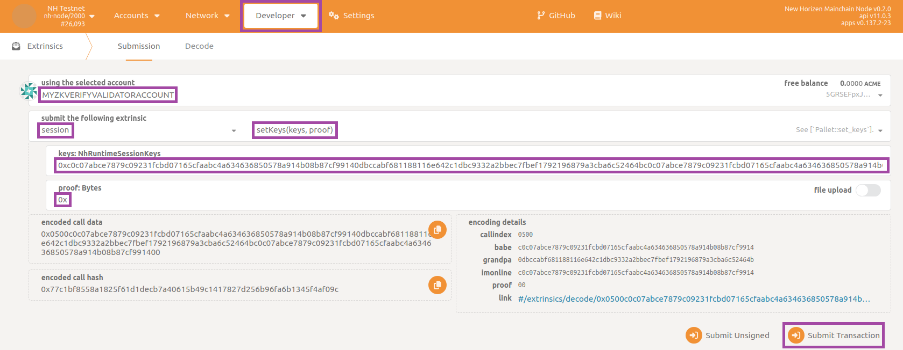
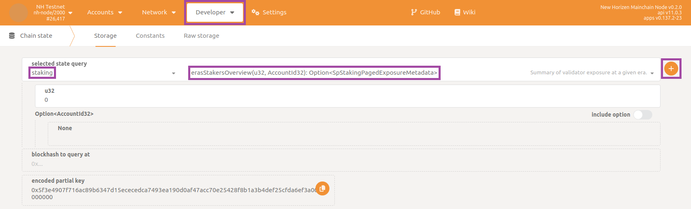
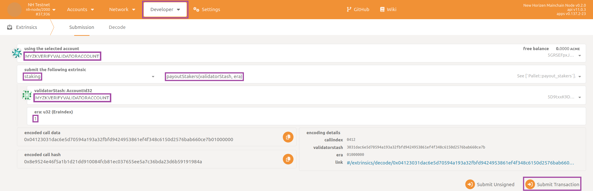

## Prepare the Environment

For running a validator node open a terminal and navigate to the root directory of project `compose-zkverify-simplified`:

```bash
cd compose-zkverify-simplified
```

then launch the initialization script by typing:

```bash
scripts/init.sh
```

The interactive session run by the script asks you for providing input related to:

- node type: you need to select validator node (refer to [this page](../01-chosing_the_node_type.md) for node types),
- network: currently only testnet is available,
- node name: just a human readable identifier,
- node key (`node_key.dat` file): you can import an already existing key or let the script to randomly generate one for you (refer to [this page](./01-preliminaries.md) for node keys),
- secret phrase (`secret_phrase.dat` file): you can import an already existing secret phrase or let the script to randomly generate one for you (refer to [this page](./01-preliminaries.md) for secret phrases).

At the end of the session the script would populate directory `deployments/validator-node/`*`network`* with the proper files and you would get a message similar to:

```bash
=== Run the compose project with the following command: 

========================
docker compose -f /home/usr/compose-zkverify-simplified/deployments/validator-node/testnet/docker-compose.yml up -d
========================
```

Before actually launching the node, you can further inspect and customize the execution by manually editing `deployments/validator-node/`*`network`*`/.env` file. Entries under `# Node miscellaneous` section are related to the Docker container, while those under `# Node config` section are related to the Substrate node instance. Pay attention to only take this action if you fully understand its implications.

## Run the Node

*Time to start now!* Within the terminal type the command proposed by the script:

```bash
docker compose -f /home/usr/compose-zkverify-simplified/deployments/validator-node/testnet/docker-compose.yml up -d
```

*and you are done!* This allows you to start the node in background, for checking it is running properly you can type:

```bash
docker container ls
```

and you should get something similar to:

```bash
CONTAINER ID   IMAGE                            COMMAND                CREATED              STATUS              NAMES
ca4bdf2c6f05   horizenlabs/zkverify:0.2.0-rc1   "/app/entrypoint.sh"   About a minute ago   Up About a minute   validator-node
```

showing your node has started correctly.

Up to here your validator node is running properly but, in order to make it eligible for authoring new blocks, you need to follow through with a few additional steps.

## Next Steps

In this section you can learn how to register a new validator on the blockchain. The operations described below must be performed just once and they consist in the submission of some extrinsics (transactions, in Substrate terminology) resulting eventually in your node being able to author new blocks and consequently earn new tokens through staking mechanism. Note that since you are going to submit extrinsics which changes the blockchain state, you need sufficient funds in the account (uniquely identified by your secret phrase) associated with your validator so that you can pay transaction fees; if that's not your case, it is mandatory you send some tokens to it.

For security reasons your validator node does not expose an RPC interface but you need a user friendly way for submitting the extrinsics, so the first thing to do is to temporarily run an additional RPC node (refer to [this page](./02-run-rpc-node.md#Explore-and-Interact-with-the-Node)) which you can shutdown once you have completed everything.

Make sure both your validator node as well as your RPC node are running using command:

```bash
docker container ls
```

and you should get something similar to:

```bash
CONTAINER ID   IMAGE                         COMMAND                CREATED              STATUS              NAMES
096d0c5d1117   horizenlabs/zkverify:latest   "/app/entrypoint.sh"   About a minute ago   Up About a minute   rpc-node
b693d6143f0d   horizenlabs/zkverify:latest   "/app/entrypoint.sh"   10 minutes ago       Up 10 minute        validator-node

```

Then you can connect to the RPC node using PolkadotJS (refer to [this section](./02-run-rpc-node.md#Explore-and-Interact-with-the-Node) for a brief walkthrough) and start submitting RPC commands and extrinsics.

In order to use PolkadotJS with your validator account, you need to import it within the application.

From here on you can choose any the extrinsic you submit with PolkadotJS to use your validator account (even if you are submitting them with your rpc node, doesn't matter since you imported your validator account), hence transaction fees will be deducted from its balance.

Now you need to define the session public keys your validator node will use for participating in the consensus (i.e. authoring new blocks and selecting the best chain). This can be achieved by concatenating the three Babe, Grandpa and ImOnline public keys you can derive from your secret phrase. Inside a terminal type this command:

```bash
docker run --rm -ti --entrypoint nh-node horizenlabs/zkverify:latest key inspect --scheme sr25519
```

and provide your validator secret phrase when prompted for (`URI:`), then hit enter; you should get a response similar to:

```bash
Secret phrase:       demise trumpet minor soup worth airport minor height sauce legend flag timber
  Network ID:        substrate
  Secret seed:       0x9b6a3ec8063e64e9d896ed8dbcd895d7fd0d7a3a982ed9b6839e2b55c49b9e15
  Public key (hex):  0xc0c07abce7879c09231fcbd07165cfaabc4a634636850578a914b08b87cf9914
  Account ID:        0xc0c07abce7879c09231fcbd07165cfaabc4a634636850578a914b08b87cf9914
  Public key (SS58): 5GRSEFpxJ8rU4LLiGrsnvkk7s1hdJXFZzx1T41KhECzTn7ot
  SS58 Address:      5GRSEFpxJ8rU4LLiGrsnvkk7s1hdJXFZzx1T41KhECzTn7ot
```

the `Public key (hex)` representing the Babe key and the ImOnline key.

Repeat again the command varying the last parameter, in this way:

```bash
docker run --rm -ti --entrypoint nh-node horizenlabs/zkverify:latest key inspect --scheme ed25519
```

and provide same secret phrase when prompted for (`URI:`), then hit enter; you should get a response similar to:

```bash
Secret phrase:       demise trumpet minor soup worth airport minor height sauce legend flag timber
  Network ID:        substrate
  Secret seed:       0x9b6a3ec8063e64e9d896ed8dbcd895d7fd0d7a3a982ed9b6839e2b55c49b9e15
  Public key (hex):  0x0dbccabf681188116e642c1dbc9332a2bbec7fbef1792196879a3cba6c52464b
  Account ID:        0x0dbccabf681188116e642c1dbc9332a2bbec7fbef1792196879a3cba6c52464b
  Public key (SS58): 5CNiZaphDhE8gT7cCDNZrXkd6vFfsuPjNQqdS8eEEw8mroHp
  SS58 Address:      5CNiZaphDhE8gT7cCDNZrXkd6vFfsuPjNQqdS8eEEw8mroHp
```

the `Public key (hex)` representing the Grandpa key.

Now you just need to concatenate the three keys respecting this order: Babe, Grandpa and ImOnline. In the example above this would result in: `0xc0c07abce7879c09231fcbd07165cfaabc4a634636850578a914b08b87cf99140dbccabf681188116e642c1dbc9332a2bbec7fbef1792196879a3cba6c52464bc0c07abce7879c09231fcbd07165cfaabc4a634636850578a914b08b87cf9914` (note hexadecimal prefix `0x` is written just once). This is the set of session public key of your validator.

After generating the set of keys, you have to register them in the blockchain, so that they are available to all the nodes in network. You can achieve this submitting a specific extrinsic through PolkadotJS. Navigate to section `Developer` then subsection `Extrinsics` and select `session`, `setKeys` in the two dropdown panels; remember to select your validator account as `using the selected account`, then fill in the textboxes `keys: NhRuntimeSessionKeys` and `proof: Bytes` respectively with the set of session public keys you just prepared and with empty value `0x`, finally click on `Submit Transaction` button:



insert your account password and confirm by clicking on button `Sign and Submit`:


in few seconds you should receive a feedback by a popup message on the top-right corner confirming you the extrinsic has been succesfully submitted.

Now that the blockchain knows those public session keys are associated to your validator account, you can proceed staking some of the tokens you own in order to have a chance to be elected as a validator for the next sessions. To achieve this you have to submit another type of extrinsic.

But before doing this, you'd want to know what is the current stake of other validators, in order to stake sufficient tokens to become an active validator; current **zkVerify** implementation requires to be at least in the **top 10 stakers** in order to be included in the active validators set. Navigate to section `Developer` then subsection `Chain state` and select `staking`, `erasStakersOverview` in the two dropdown panels, finally click on `+` button:



the response you get should have a payload similar to this:

```json
[
  [
    [
      0
      5ETuZEyLnfVzQCaDM8aQCcsNnz6xjPKvQCtqynCLqwng8QLd
    ]
    {
      total: 279,999,999,999,999,999,995,132,984
      own: 279,999,999,999,999,999,995,132,984
      nominatorCount: 0
      pageCount: 0
    }
  ]
  [
    [
      0
      5D29UEzgStCBTnjKNdkurDNvd3FHePHgTkPEUvjXYvg3brJj
    ]
    {
      total: 279,999,999,999,999,999,995,132,984
      own: 279,999,999,999,999,999,995,132,984
      nominatorCount: 0
      pageCount: 0
    }
  ]
  [
    [
      0
      5DiMVAp8WmFyWAwaTwAr7sU4K3brXcgNCBDbHoBWj3M46PiP
    ]
    {
      total: 139,999,999,999,999,999,971,572,664
      own: 139,999,999,999,999,999,971,572,664
      nominatorCount: 0
      pageCount: 0
    }
  ]
]
```

In the example above the third active validator (sorting them from highest to lowest stake) has staked `139,999,999,999,999,999,971,572,664 ACME` so you are required to stake at least that amount for participating actively.

For submitting staking extrinsic navigate back to section `Developer` then subsection `Extrinsics` and select `staking`, `bond` in the two dropdown panels; remember to select your validator account as `using the selected account`, then fill in the textboxes `value: Compact<u128> (BalanceOf)` and `payee: PalletStakingRewardDestination` respectively with the amount of tokens you want to stake and the value `Account` followed by selection of your validator account, finally click on `Submit Transaction` button:


insert your account password and confirm by clicking on button `Sign and Submit`. Wait for popup message confirming successful submission.

Now that the blockchain knows you have staked your tokens it's time for the last step, namely declaring you are actually ready to act as a validator. Navigate again to section `Developer` then subsection `Extrinsics` and select `staking`, `validate` in the two dropdown panels; remember to select your validator account as `using the selected account`, then fill in the textboxes `commission: Compact<Perbill>` with the fraction of the commission you keep if other user delegate their tokens to you by nomination (parts per billion, if you don't know which value to set use `100000000`) and select `No` in the dropdown panel `blocked: bool`, finally click on `Submit Transaction` button:


insert your account password and confirm by clicking on button `Sign and Submit`. Wait for popup message confirming successful submission.

*And you've completed it!* You just need to wait for the completion of the current era and of the next one (since an era lasts for 6 hours, in the worst case this would be 12 hours), thereafter your node will start authoring new blocks. You can check this navigating to section `Network` then subsection `Explorer` for a summarized view of the list of recently authored blocks, or to section `Network` then subsection `Staking` for an advanced console specifically designed for staking.

If you are interested in how to claim the new tokens you deserve as an active validator, navigate to section `Developer` then subsection `Extrinsics` and select `staking`, `payoutStakers`; remember to select your validator account as `using the selected account`, then choose your validator account as `validatorStash: AccountId32` and insert target era in the textbox `era: u32 (EraIndex)`, finally click on `Submit Transaction` button:



Note that you'd want to periodically repeat this claim operation (even better to automate it in some way) as the blockchain progresses; keep in mind you can claim reward for previous era up to a **backward limit of 30 eras** (approximately one week).
