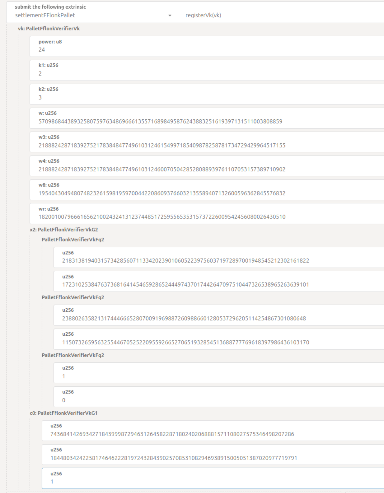

## [`settlementFflonkPallet`](https://github.com/HorizenLabs/NH-core/tree/main/pallets/settlement-fflonk)

The [`submitProof`](https://github.com/HorizenLabs/NH-core/tree/main/pallets/settlement-fflonk/src/lib.rs#L131)
extrinsic checks if the given proof is valid proof fflonk proof. The extrinsic arguments are:

- The proof data composed by 800 bytes array where public inputs are in the last 32 bytes
- An optional `VkOrHash` variant where you can provide either a Verification key or its hash to retrieve it from storage. If it's absent the
verifier will use the Polygon-CDK Fork-Id verification key

This extrinsic use [`fflonk_verifier` crate](https://github.com/HorizenLabs/fflonk_verifier/tree/v0.4.0) to deserialize
the proof and public inputs and then verify them against the given verification key.

### Register Verification Key

If you would to use the hash of verification key instead of the key itself you need to register it before by use
[`registerVk`](https://github.com/HorizenLabs/NH-core/tree/main/pallets/settlement-fflonk/src/lib.rs#L158). This
extrinsic save the verification key in the storage and emit a `SettlementFFlonkPallet::VkRegistered(hash)` event
with the hash that can be used in `submitProof`.

The fflonk verification key have the follow structure:

```rust
pub struct Vk {
    power: u8,
    k1: Fr,
    k2: Fr,
    w: Fr,
    w3: Fr,
    w4: Fr,
    w8: Fr,
    wr: Fr,
    x2: G2,
    c0: G1, 
}
```

You can fill all the fields with both hex or decimal string: an example from _Polkadot.js_ interface is
the follow.



### Result

The pallet's duties are summarized in the following code snippet:

```rust
let proof = Proof::try_from(&proof_data).unwrap();
let pubs = pubs_data.into();
let vk = vk.into();

fflonk_verifier::verify(vk, &proof, &pubs)
```

If the proof is correct a `Poe::NewElement(statement, attestation_id)` event is emitted where `statement`
is computed by using `fflonk` as `verifier-id`.

This call can fail both if it's not possible to deserialize the proof (`InvalidProofData`) or if the proof doesn't
verify (`VerifyError`)
