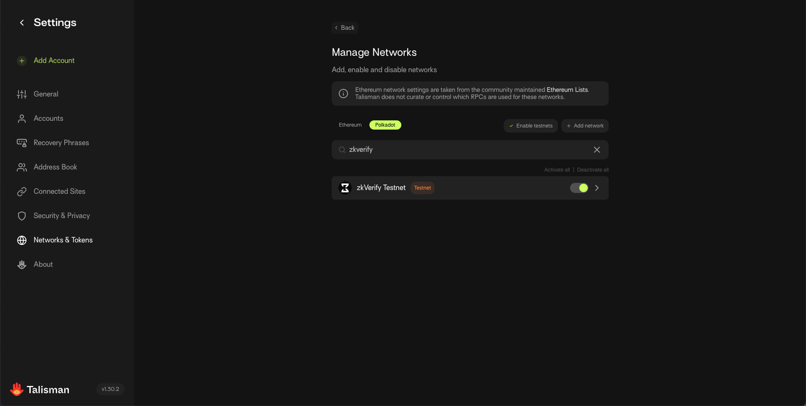
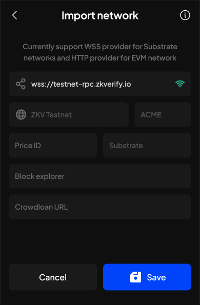

# Connect a Wallet

## Recommended Wallets

### Talisman

Talisman provides a secure and user-friendly platform for managing assets, interacting with dApps, and exploring both the Polkadot and Ethereum ecosystems. With support for a variety of networks, NFT management, and hardware wallets, Talisman presents itself as a holistic wallet solution.

https://www.talisman.xyz/

### SubWallet

A comprehensive Polkadot, Substrate and Ethereum wallet.
SubWallet is a versatile option for managing assets across over 150 networks. With support for hardware wallets, light clients and MetaMask compatibility, it caters to a wide range of user preferences and needs.

https://www.subwallet.app/

## Connecting to zkVerify Testnet

Below are the zkVerify Testnet RPC URL and zkVerify Testnet Explorer URL that will be used to configure the wallet connection, allowing you to interact with the testnet blockchain the recommended browser wallets:

| <!-- -->                  | <!-- -->                                |
|---------------------------|-----------------------------------------|
| zkVerify Testnet RPC URL  | wss://testnet-rpc.zkverify.io           |
| zkVerify Testnet Explorer | https://testnet-explorer.zkverify.io/v0 |

Follow the instructions below to set up your wallet with these variables and start exploring the zkVerify Testnet blockchain.

### Using Talisman

1. Go to Settings.
2. Select Network & Tokens.
3. Choose Manage Networks.
4. Find and click on Polkadot.
5. Search for "zkVerify Testnet" and activate using the toggle.

### Using SubWallet

1. Go to Settings (top left icon).
2. Choose Manage Networks.
3. Search for "zkVerify Testnet" in the list.
4. Click on the corresponding button to enable it.

## Get $ACME zkVerify Testnet Tokens

Head on over to our [Testnet Faucet](https://zkverify-faucet.zkverify.io/), submit your email address and Wallet Address and you will receive $ACME within 24 hours.

After you receive your $ACME zkVerify testnet token, we have a few different user activities you can try out!

* [Submit and verify a Polygon CDK proof to the zkVerify testnet](./05-submit-proofs/03-polygon_cdk_proof_submission.md)
* [Deploy a full CDK zkRollup, EVM-compatible network on Sepolia that uses zkVerify testnet as the Proof Verification layer](./08-run-a-zkrollup/04-polygon_cdk_installation.md)
* [Deploy a full zkSync Era zkRollup, EVM-compatible network on Sepolia that uses zkVerify testnet as the Proof Verification layer](./08-run-a-zkrollup/02-zksync_installation.md)

Thank you for testing! If you have any questions or require support from the team, feel free to reach out to us on [Discord](https://discord.gg/zkverify).
