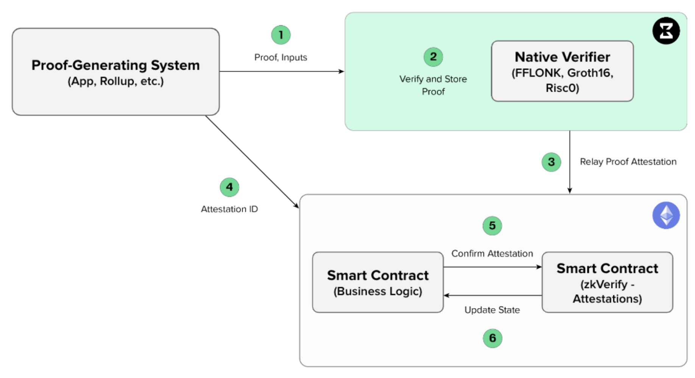
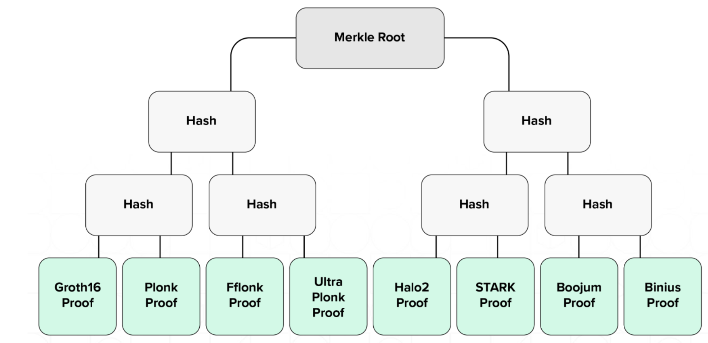

# Porting Your dApp to zkVerify

This guide will walk you through the process of porting your dApp to [zkVerify](https://zkverify.io/), the modular blockchain for ZK proof verification. By integrating with zkVerify, your dApp can leverage zero-knowledge proofs for enhanced security and functionality.

## Prerequisites

Before you begin, ensure you have:

- A basic understanding of blockchain and smart contract development.

- Familiarity with your existing dApp architecture, ZK proof processing flow, and codebase.

- A [wallet](connect-a-wallet) with [funds](get_testnet_tokens) ($ACME) connected to the network.

## High-Level dApp Architecture

The figure below demonstrates one possible integration of zkVerify into a typical ZK application flow. The responsibility of verifying proofs has been delegated entirely to zkVerify, and only attestations (small hashes) are ever stored on the settlement chain.

1. **Proof-Generating System:** This can be any application (e.g. a zkRollup or zkApplication) that generates a zero knowledge proof to prove some computation has been done by the application. In the case depicted, it is an application that lives on a blockchain, but this is not a requirement (i.e. it could be a web2 application).

2. **Verify and Store Proof:** The proof is submitted to zkVerify via an RPC call. The proof then enters the mempool, gets verified by the receiving node, and is propagated to the rest of the network in a proposed block. As a part of consensus, it is verified by the rest of the nodes as they receive the proposed block. After consensus is reached, the block is added to the blockchain and stored.

3. **Relay Proof Attestation:** After a sufficient number of proofs are verified (or after a pre-specified amount of time has lapsed), they are bundled into an attestation. The attestation data structure is a digitally-signed message that contains the root of a Merkle tree that has proofs as leaves. Although it is not a ZK proof, the attestation is a cryptographic proof that allows for smart contract clients to verify it on-chain via a Merkle proof. It comes in the form of an event contained in the same block the proof has been included into.

  

  

    <strong>Figure</strong>: zkVerify Merkle tree, which shows various proof types at its leaves, serving as a form of natural aggregation across <strong>heterogeneous proving systems</strong>.
  

4. **Attestation ID:** The Attestation ID is the unique identifier that is generated by zkVerify and enables the zkApplication to quickly and efficiently look up the results of the proof verification in the zkVerify smart contract.

5. **Confirm Attestation:** The smart contract that belongs to the zkApp on the L1 can verify the proof has been verified by zkVerify by checking the smart contract via a Merkle proof. Alternatively, and depending on the implementation, a callback function can be triggered such that the zkApp can proceed with further actions if necessary.

6. **Update State:** This is an optional step, but refers to the zkRollup use case where the state of the rollup needs to be updated. It can be updated via the callback function as noted above, or by the application directly reading from the zkVerify smart contract on the L1.

## Step-By-Step Process

### Step 1: Send your Proof to zkVerify

- You can submit the proof via the [_submitProof_](https://docs.zkverify.io/overview/mainchain/mainchain_api#submitproof) extrinsic of the appropriate verification pallet supplying proof, vk, and public inputs.

- \[Optional\] Instead of passing each time you want to submit a proof the verification key to the _submitProof_ extrinsic, you have the possibility to register it in advance via the [_registerVk_](https://docs.zkverify.io/overview/mainchain/mainchain_api#registervk) extrinsic. If your key has been registered successfully, a [_vkRegistered_](https://docs.zkverify.io/overview/mainchain/mainchain_api#registervk) event containing the hash of your verification key will be emitted. Save this value.
In fact, if you registered the vk in this way, then you will be able to pass to the _submitProof_ extrinsic the hash of it instead of the full one (getting lower transaction fees on subsequent submissions).

Below are the zkVerify Testnet RPC URL and zkVerify Testnet Explorer URL, allowing you to interact with the Testnet blockchain:

**zkVerify Testnet RPC URL:** `wss://testnet-rpc.zkverify.io`

**zkVerify Testnet Explorer:** `https://testnet-explorer.zkverify.io/v0`

There are different ways through which your client can interact with our chain:

- Javascript/Typescript via the [PolkadotJS](https://github.com/polkadot-js) library

- Rust, via the [subxt](https://github.com/paritytech/subxt) crate

- Manually, via the Polkadot JS [frontend](https://polkadot.js.org/apps/?rpc=wss://testnet-rpc.zkverify.io#/explorer)

### Step 2: Listen to the Proof being verified and attestation produced

- If the submitted proof is valid, it is relayed by the consensus and eventually included in a Mainchain block; otherwise the transaction reverts with an error.

- When the block in which the proof was posted is finalized, a [_NewElement_](https://docs.zkverify.io/overview/mainchain/mainchain_api#newelement) event is emitted, containing the digest of the proof and the id of the attestation in which the proof will be included. Make sure to save these values somewhere.

- Your proof will be included in a Merkle Tree. The proof leaf value will be:

  `leaf_digest = keccak256(keccak256(verifier_ctx), hash(vk), keccak256(public_inputs_bytes))`

  Every verifier defines its _verifier\_ctx_ (a unique byte sequence), how to hash the verification key and how to extract a byte sequence from public inputs. Then, to produce the _leaf\_digest_, the previous formula has to be applied. Please [refer](https://docs.zkverify.io/overview/verification_pallets/abstract) to the zkVerify docs to see how each verification pallet defines such parameters (unders sections _Statement hash components_). The _leaf\_digest_ must be computed separately also by your application and the resulting value used to check, on-chain, that your proof has been verified by the zkVerify blockchain.

- You can retrieve the Merkle Path of your proof within the aforementioned Merkle Tree via the [_proofPath_](https://docs.zkverify.io/overview/mainchain/mainchain_api#poe_proofpath) RPC command of the [_PoE_](https://docs.zkverify.io/overview/mainchain/mainchain_api#poe) pallet, supplying the attestation id and the digest of the proof. Make sure to save the Merkle Path.

- Once the zkVerify blockchain is ready to produce an attestation, a [_NewAttestation_](https://docs.zkverify.io/overview/mainchain/mainchain_api#newattestation) event is emitted, containing the id of the attestation and the attestation itself, which is simply the Merkle Root built from all the proofs that have been submitted and verified in a given time frame.

- The attestation bot relays the attestation to the on-chain zkVerify smart contract on the settlement networks (e.g. Sepolia, Curtis, Gobi).

- The attestation bot triggers under the following conditions:

  - If 16 proofs have been published, or

  - Every 10 blocks (about 1 minute) if at least one proof has been submitted.

### Step 3: Modify your dApp Smart Contract Logic

The next step is to modify your dApp smart contract to call the zkVerify smart contract instead.

Please take a look at our [documentation](https://docs.zkverify.io/overview/smart_contract/smart_contract_functionality) for more details or directly to the [codebase](https://github.com/HorizenLabs/zkv-attestation-contracts).

- The zkVerify relayer will call the [_submitAttestation_](https://docs.zkverify.io/overview/mainchain/mainchain_api#newattestation) method of the zkVerify smart contract, storing the new attestation on-chain. The latency of this process is negligible. Upon successful execution, an _AttestationPosted_ event will be emitted, containing the attestation id and the attestation itself.

- Once your client receives the event corresponding to the attestation id you saved when you submitted the proof, it’s time to invoke the method of your smart contract which is supposed to verify the zk proof (plus any other business logic that you’ve encoded).

- Your method shall invoke the [_verifyProofAttestation_](https://docs.zkverify.io/overview/smart_contract/smart_contract_functionality#verify-proof-attestation-method) method of the zkVerify smart contract. You should have saved all the required values, but you need to recompute in your smart contract the _\_leaf_ according to the formula presented in the previous step.

- You have now verified your zk proof on-chain without executing the verification algorithm itself, and at the cost of a simple merkle path check! Congratulations!

**The zkVerify smart contract is currently deployed on several chains:**

Sepolia (Ethereum Testnet)

[0x209f82A06172a8d96CF2c95aD8c42316E80695c1](https://sepolia.etherscan.io/address/0x209f82A06172a8d96CF2c95aD8c42316E80695c1)

Curtis (Apechain Testnet)

[0x82941a739E74eBFaC72D0d0f8E81B1Dac2f586D5](https://curtis.explorer.caldera.xyz/address/0x82941a739E74eBFaC72D0d0f8E81B1Dac2f586D5)

Gobi (EON Testnet)

[0x6A51D573Bf6fcFdb5D4E394645647304bb9FAb5B](https://gobi-explorer.horizenlabs.io/address/0x6A51D573Bf6fcFdb5D4E394645647304bb9FAb5B)

## Code Examples and References

- E2E tests in zkVerify [repository](https://github.com/HorizenLabs/zkVerify):

- [Submit proof, wait for attestation, get the Merkle Path](https://github.com/HorizenLabs/zkVerify/blob/main/zombienet-tests/js_scripts/0005-proofPath_rpc.js)

- [Register vk, submit proof, wait for successful verification](https://github.com/HorizenLabs/zkVerify/blob/main/zombienet-tests/js_scripts/0007-proof_with_vk.js)

- TypeScript template [repository](https://github.com/HorizenLabs/zkverify-example-typescript):

- [Tutorial](https://docs.zkverify.io/tutorials/submit-proofs/typescript-example)

- [Main logic](https://github.com/HorizenLabs/zkverify-example-typescript/blob/main/src/index.ts)

- Checkout the [Tutorials-Submit Proofs](https://docs.zkverify.io/tutorials/submit-proofs/typescript-example) section of the zkVerify [docs](https://docs.zkverify.io/) for several examples on how to submit proof in Typescript, NextJS, PolkadotJS, PolkadotJS Frontend, etc.

- For some examples related to the L1 logic, involving client configuration and smart contract modifications, you can refer, for instance, to our tutorials on zkRollups integration, for instance:

- Polygon CDK:

      *   [Tutorial](https://docs.zkverify.io/tutorials/run-a-zkrollup/polygon_cdk_installation)

      *   [Repository](https://docs.zkverify.io/tutorials/run-a-zkrollup/polygon_cdk_installation)

      *   New [_verifyBatches_](https://github.com/HorizenLabs/cdk-validium-contracts/blob/main/contracts/CDKValidium.sol#L768) method after modifications to interact with zkVerify contract

      *   Modifications to [cdk-validium-node](https://github.com/HorizenLabs/cdk-validium-node/blob/main-hl/aggregator/aggregator.go) to send proofs to zkVerify (instead of Ethereum), parse the Merkle Path, waiting for attestation to be published on Ethereum, invoking the smart contract for verification via zkVerify smart contract.

      *   [Test showing the interaction](https://github.com/HorizenLabs/cdk-validium-contracts/blob/main/test/contracts/newHorizenSupernets2.test.js)
