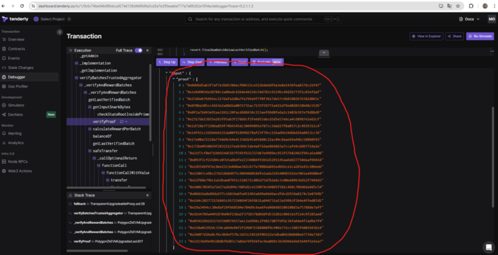
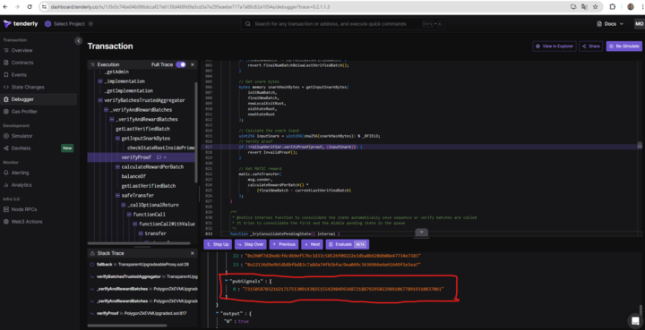
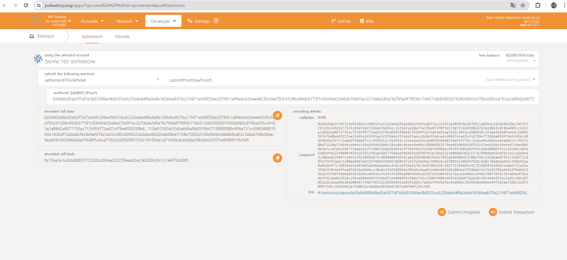

# Proof Submission with Tenderly
In this tutorial we'll go through the process of submitting and verifying a Polygon CDK proof to the zkVerify chain.

## Requirements
- A Substrate compatible wallet with funds (ACME) connected to the network
- A Polygon CDK (Fork_ID 6) FFLONK proof

## Step 1
Identify a `VerifyBatches` or `VerifyBatchesTrustedAggregator` transaction that is compatible with fork id 6.

It is possible to find this kind of transaction at this [address](https://etherscan.io/address/0x5132a183e9f3cb7c848b0aac5ae0c4f0491b7ab2) (Polygon CDK Proxy contract).
According to these [releases document](https://docs.polygon.technology/zkEVM/get-started/historical-data/) the time range in which you can look for transactions is between November 2023 and January 2024.

For example:

https://etherscan.io/tx/0x5c74be04b086dccaf27e6138d468fd9a3cd3a7e295eaebe717a7a88c82a1054a

## Step 2

Gather the Public Input and the Proof using [Tenderly](https://tenderly.co/).

Replace your transaction ID in this URL: https://dashboard.tenderly.co/tx/1/YOUR_TRANSACTION_ID/debugger?trace=0.2.1.1.3

For example:

https://dashboard.tenderly.co/tx/1/0x5c74be04b086dccaf27e6138d468fd9a3cd3a7e295eaebe717a7a88c82a1054a/debugger?trace=0.2.1.1.3

From the bottom console copy the content of the field `proof` and remove all the junk characters to make it into a single line without `"` and `0x` (a part from the first).



In this example the value is:

`0x0d6bd5ab3f7af7e3b85386ecfb0533ce522bde6df6a3e8e143bfea837bc21f471eb89036e28789c1a09edc62b4e44236c54d783c9129bc49d2b773f1c83efdaf23d6eb7b691ec227dafa2d0a7fa769a9f7f0f3b17de57c6b83802676382d063c070ba305cc41b3e2a88d2a0071735ac7135f59772a421d79ed020338b48c552b0f2a76d43e91aa3262c20facd688436c153aef69d0feda3c1403b397e79d8bd92317de13b55e263f95ab3f278ddcf2fe6d53abcd3d5e57e6ca4c68987e1e62cf1d728e773286a859f74b9345dc30499895e787cc3da627f8a057c2c4929311c414f63cc2d1b6eb121da00f918998278af23f79cc21bad9e24dbbd24a8653cc3617e00a72118a77e8d4cb4e4c158d245a910d0c22ac04c8aaeb9a44bc588b0593173be0930859f28322127eeb3b9c5de4a9716ae866863a7ccafe9cdd97714a2e21f7cf0ef31bb924d51b7f595f632727d67e9989ec953f57b82465f99ca5ed08093f3cf22104ce07e5a8bdfe22334084f43b5d3291145aa6dd27750daaf694182d5566f47ec8ee2113e860ae362cb77e7808dabb1edb92ce1ca265e43c20beeb15047ce9bc27421868d975c90940d018dfe1ada356540983562e7061ad4980e412f88e79bc1a5dbae07951c510171c805d75d7b2ebc3c00e689636d12f7494d310017058fa72e57a26d94c7605d2ce539074cb90d5f581c4b8c706d6da4d5c540b816a8e89da5f7c16834a6fa4514b5ab96ebbd6acdfdcd2934a8174c5e8769b164c202772156845c917234894f26f6b31a844731a53a599b3f3b4e4ffed07d519a3494cc30e8af29f668584e784d9c6ea6fed4bb685106108d3a75788de7aff1b34789a4491878d4bf23ba1f3758378db68fd532d62c0663e1f124c9f285ae8054226b2d327e55b0974157aec1ed96bc2f4817d07fdfdc3bfa64e4f3ad9e7f4110a01292dc334ca664e9bf2f19b071588808f8c906e731cc5883f4801943b142b0f7d2be8cf6c4b9ef57bc3d33c58526f09222e3dba8b620db08e47734e738322136d9e9b5db8bfbd83c7a8da74fb5bfac9ea069c3636966e6e61649f1e5ea7`

And the content of the field `pubSignal` (Public Input)



In this example the value is: `7315058703216217175130914302515542984993687218879295022989106778919310837061`

Convert it into a hexadecimal format (take care to pad left the result with zeros to obtain 64 chars length string) to obtain: `102C2D2F58997310C191634E1A71B00CDC4DD6E28B5BB42587ED8F40F119C545`

## Step 3

Send the proof to zkVerify chain.
In order to do this you can use [PolkadotJs](https://polkadot.js.org/apps/?rpc=wss%3A%2F%2Ftestnet-rpc.zkverify.io#/extrinsics).

- Select your account (you must have some ACME)
- Choose the `settlementFFlonkPallet` and the call `submitProof`
- Inside the field `vkOrHash` select `Vk` and paste the following data

    ```json
    `{
        "power": 24,
        "k1": "2",
        "k2": "3",
        "w": "5709868443893258075976348696661355716898495876243883251619397131511003808859",
        "w3": "21888242871839275217838484774961031246154997185409878258781734729429964517155",
        "w4": "21888242871839275217838484774961031246007050428528088939761107053157389710902",
        "w8": "19540430494807482326159819597004422086093766032135589407132600596362845576832",
        "wr": "18200100796661656210024324131237448517259556535315737226009542456080026430510",
        "x2": [
            [
                "21831381940315734285607113342023901060522397560371972897001948545212302161822",
                "17231025384763736816414546592865244497437017442647097510447326538965263639101"
            ],
            [
                "2388026358213174446665280700919698872609886601280537296205114254867301080648",
                "11507326595632554467052522095592665270651932854513688777769618397986436103170"
            ],
            [
                "1",
                "0"
            ]
        ],
        "c0": [
            "7436841426934271843999872946312645822871802402068881571108027575346498207286",
            "18448034242258174646222819724328439025708531082946938915005051387020977719791",
            "1"
        ]
    }
    ```  

- Inside the fields `Proof` and `Pubs` paste the string obtained from the previous step
- Click on `submitTransaction`



## Step 4

Check your transaction on the [zkVerify Block Explorer](https://testnet-explorer.zkverify.io/v0)!
