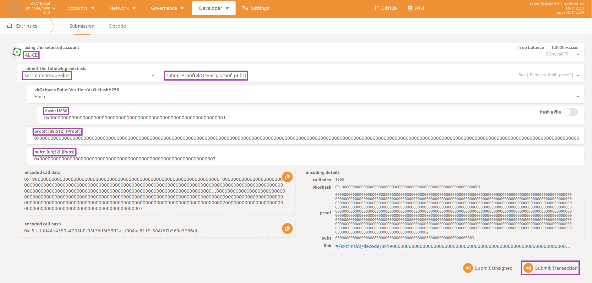

## Local Testing

Before your integration is completed, you will want to make sure everything works as expected from a user's perspective.

In order to achieve this, you need to start a local devnet on your machine.  This network is totally your own - its only purpose is to provide developers with a quick and clean environment where they can play and test using dummy tokens.

The first thing you need to do is to create a temporary Docker image.  Open a terminal at repository root and use these commands:

```bash
. cfg
bootstrap.sh
```

At the end of the process you can check the new Docker image (tag `latest`) has been created with:

```bash
docker image ls
```

It's now time to run the local chain.  Here you can leverage the Docker compose file provided in the repository:

```bash
docker compose -f docker/dockerfiles/zkv-docker-compose.yaml up
```

The command above starts a local chain from scratch (genesis block) with two validators and one RPC node.  Check the logs in the terminal to ensure that everything is fine (i.e. the three nodes are connected with each other, blocks are authored and so on).

Finally you need to check your pallet and its functionality are available. To do this, open your favorite browser targeting [PolkadotJS](https://polkadot.js.org/apps/?rpc=ws%3A%2F%2F127.0.0.1%3A9944#/explorer), then:

- Navigate to the section called `Developer` then to the subsection `Extrinsics`.
- Select `Alice` in the `using the selected account` dropdown.
- Select your pallet (here `settlementFooPallet`) in the `submit the following extrinsic` dropdown and choose `submitProof`.
- Select `Vk` in the `vkOrHash` dropdown, then insert the values for `Vk`, `proof` and `pubs` (you can use those contained in `verifiers/foo/src/resources.rs`).
- Click on the `Submit Transaction` button and then again on the `Sign and Submit` button.



In few seconds you should receive a green pop-up message on the top-right corner confirming the extrinsic has been succesfully submitted.

When you have completed testing your pallet, you can clean up your environment by tearing down the containers with `docker compose -f docker/dockerfiles/zkv-docker-compose.yaml up` and possibly removing the Docker image with `docker image rm`.

:::tip[**Testing with binaries**]
The test described above can also be performed by directly using binaries built from source (i.e. without Docker).  Make sure to launch two validators and one RPC node, each one with the proper command-line arguments.
:::

And if you were able to get to this point it means you did a great job! It's now time to open your PR on the zkVerify repository, thanks for contributing!
