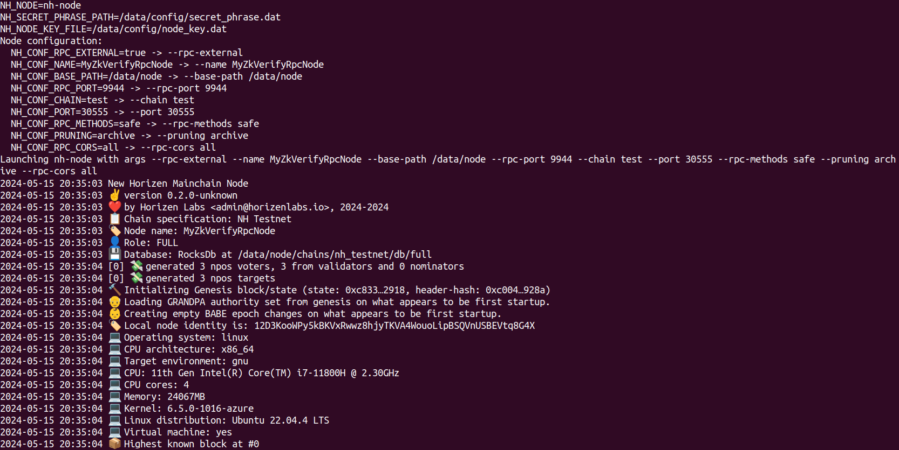
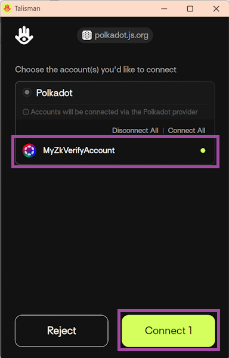
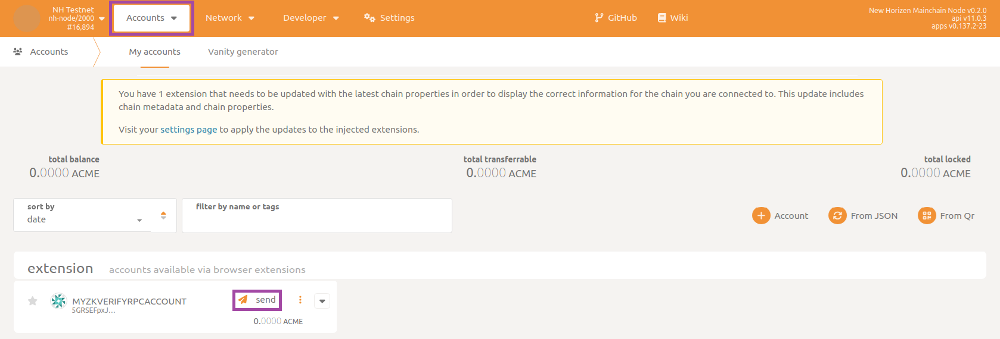

## Prepare the Environment

To run a new RPC node (refer to [this page](../01-getting_started.md#node-types.md) for node types) open a terminal and navigate to the root directory of project `compose-zkverify-simplified`:

```bash
cd compose-zkverify-simplified
```

Then launch the initialization script by typing:

```bash
scripts/init.sh
```

The interactive session run by the script asks you for the following inputs:

- Node type: select RPC node.
- Network: currently only testnet is available.
- Node name: a human readable identifier.
- Category of methods to expose: allows you to specify if you want to expose only safe methods (in case your machine is externally reachable) or all methods.
- Archival feature: allows you to specify if you want to maintain a full or partial copy of the blockchain.

At the end of the session the script will populate the directory `deployments/rpc-node/`*`network`* with the proper files.  You will get a message similar to the following:

```bash
=== Run the compose project with the following command:

========================
docker compose -f /home/your_user/compose-zkverify-simplified/deployments/rpc-node/testnet/docker-compose.yml up -d
========================
```

Before launching the node, you can further inspect and customize the execution by manually editing `deployments/rpc-node/`*`network`*`/.env` file. Entries under the `# Node miscellaneous` section are related to the Docker container, while those under the `# Node config` section are related to the Substrate node instance.

:::warning
Ensure that you fully understand the implications of customizing the execution manually if you choose to do so.
:::

## Run the Node

**Now we'll start running the node.**

Within the terminal type the command below which runs the Docker container:

```bash
docker compose -f /home/your_user/compose-zkverify-simplified/deployments/rpc-node/testnet/docker-compose.yml up -d
```

Once this command is complete, your node will begin running in the background. To ensure that it is running properly, type:

```bash
docker container ls
```

and you should get something similar to:

```bash
CONTAINER ID   IMAGE                         COMMAND                CREATED              STATUS              NAMES
ca4bdf2c6f05   horizenlabs/zkverify:latest   "/app/entrypoint.sh"   About a minute ago   Up About a minute   rpc-node
```

This shows your node has started correctly.

If you want to explore and interact a bit with your node, you can proceed the walkthrough with the optional section provided below.

## Explore and Interact with the Node

Let's dive deeper and have a look at some more detailed logs, type:

```bash
docker logs rpc-node
```

and you should get something like:



Some notes on the output:

- `Launching zkv-node with args --rpc-external --name MyZkVerifyRpcNode --base-path /data/node --rpc-port 9944 --chain test --port 30555 --rpc-methods safe --pruning archive --rpc-cors all`: shows how the configurations in the `.env` file have been parsed and resulted in successful node launch.
- `Node name: MyZkVerifyRpcNode`: the configurations (`ZKV_CONF_NAME`) have been actually passed to the Substrate node.
- `Local node identity is: 12D3KooWPy5kBKVxRwwz8hjyTKVA4WouoLipBSQVnUSBEVtq8G4X`: the unique identifier for your node, automatically generated at startup.
- `Highest known block at #0`: since this is the first time the node is running, it doesn't contain any blockchain data, and the copy of the blockchain is just the genesis block (height 0).

Let's proceed looking at how the node is syncing the blockchain data. Type the command (assuming a few seconds have passed since the startup):

```bash
docker logs rpc-node
```

And you'll see the synchronization is taking place:


Focus on these lines:

- `Starting new tree with id: XXX`: these are the trees associated to the proofs that were sent to the **zkVerify** mainchain (by a wallet, a dAPP, an L2, etc.). They are verified by **zkVerify** and a root publish event is then automatically submitted. The proofs reported here are historical, published weeks or months ago, and are contained in the blocks the node is downloading from the network.
- `⚙⚙️  Syncing 1171.2 bps, target=#16085 (8 peers), best: #11823 (0xa652…b939), finalized #11776 (0x7564…3273), ⬇ 418.2kiB/s ⬆ 2.7kiB/s`: the current tip of the node (11823), the target tip of the overall chain (16085) and the number of peers your node is connected to (8) is reported in this output.

The overall synchronization depends on the actual height of the overall chain, but at the time of writing, it's a fast process requiring less than ten minutes using a standard PC on a home network. At the end of the synchronization you should be able to see something similar to:


Once your node has completed the initial download of blockchain data (batched together) it will listen for new incoming blocks (being received one by one, every six seconds).

It's not required for all of the blocks to be downloaded each time a node is shut down and then started up again, thanks to Docker.  Try the following commands:

```bash
docker compose -f /home/your_user/compose-zkverify-simplified/deployments/rpc-node/testnet/docker-compose.yml down
docker compose -f /home/your_user/compose-zkverify-simplified/deployments/rpc-node/testnet/docker-compose.yml up -d
```

then inspect recent logs with:

```bash
docker logs rpc-node --tail 100
```

and you'll see there isn't the long sequence of logs reporting the initial download of blockchain data (`Starting new tree with id: XXX`).

If for any reason you need to fully erase blockchain data you can do this by stopping the container and deleting the Docker volume:

```bash
docker compose -f /home/your_user/compose-zkverify-simplified/deployments/rpc-node/testnet/docker-compose.yml down
docker volume rm zkverify-rpc-testnet_node-data
```

## Interacting with the node

It's now time to interact with your node, and the best tool for doing that is PolkadotJS. Open up your preferred browser and type in the search bar this [URL](https://polkadot.js.org/apps/#/explorer). Then make sure you are targeting the local node by checking the dropdown panel in the top left corner:


:::note
In case you are unable to connect, check manually that inside `.env` file the value for configuration `ZKV_CONF_RPC_EXTERNAL` is set to `true` and that the value for configuration `NODE_NET_RPC_WS_PORT` matches the one you eventually typed in the `custom endpoint` textbox.
:::

First, you can try submitting some RPC commands for querying the blockchain state. An example could be asking for the block hash at a specific height and then using the result to ask for the full block body.

Navigate to to the section called `Developer` then to the subsection `RPC calls` and select the `chain` endpoint and command `getBlockHash`. Make sure to enable the `include option` flag, and then type in a block number (100 in this example).  Finally click on `Submit RPC call` button.


What you get as a response is indeed the block hash (`0xa048…ac51` here).  With this result, you can submit a second command for getting the entire body of the block. In an analogous way, select command `getBlock` and paste in the hash you have just received as the input.

Again, the node is responding to your request, this time providing the full body of the queried block.


:::note
Note that if during the execution of script `init.sh` you selected non-archival node you could incur in an error like `-32000: Client error: Api called for an unknown Block: State already discarded for 0xa048…ac51`, reporting too old data have been pruned.
:::

Another type of operation you can perform is sending some tokens from an account to another.  In Substrate, accounts are associated to a pair of keys, one private and one public (very similar to Bitcoin addresses or Ethereum EOAs).

In order to submit extrinsics (transactions, in Substrate terminology) with PolkadotJS from one of your accounts, you need to have a Polkadot-compatible browser extension wallet (like [Talisman](https://docs.zkverify.io/tutorials/connect-a-wallet#using-talisman) or [Subwallet](https://docs.zkverify.io/tutorials/connect-a-wallet#using-talisman)) installed. Then, refresh PolkadotJS web-page and the extension will be automatically detected and a pop-up window will appear asking you to connect it:



Next, navigate to the section `Accounts` then to the subsection `Accounts` and send funds by clicking on the `send` button:



Selecting your account as the source and typing in the address of the destination account and the amount of tokens to send, finally click on `Make Transfer`:


In a few seconds, you should receive feedback in a green pop-up message on the top-right corner confirming that the extrinsic has been successfully submitted and the funds have been transferred.
