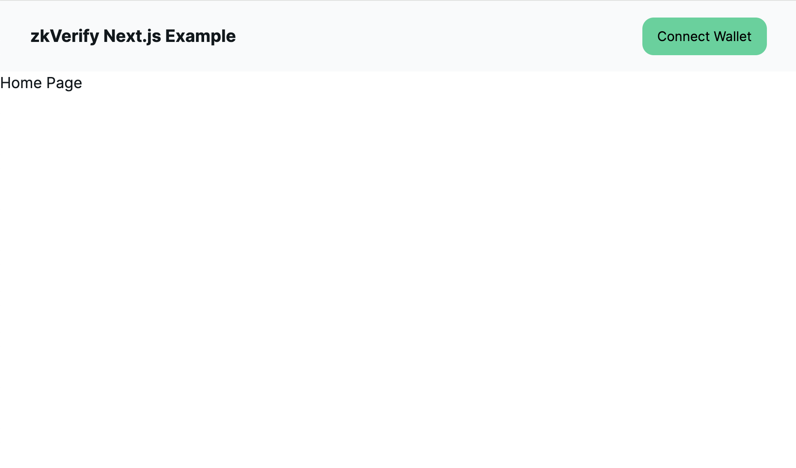
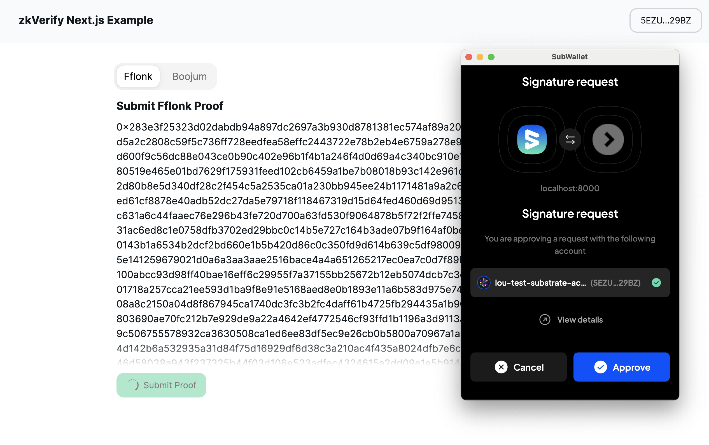
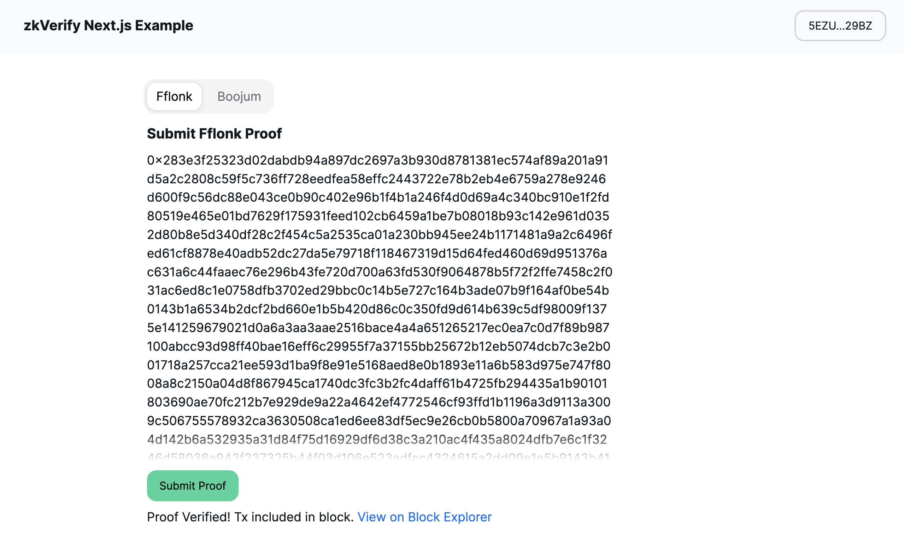

This tutorial will teach you how to build a basic [Next.js](https://nextjs.org/) project that can submit a proof to the zkVerify network from the browser. We will build a simple application where we will connect to a Substrate-compatible browser extension wallet, and submit two different proofs (Fflonk and Boojum).

:::info

TLDR; if you'd like to jump right into the code, the completed project is available in this [GitHub Repository](https://github.com/loucaponi/zk-verify-nextjs-example)

:::

## Prerequisites

This tutorial assumes you have already followed the [Connect a Wallet](../02-connect-a-wallet.md) tutorial. By now you should have a proper wallet installed, and are able to connect to the zkVerify testnet.

> If you are still waiting for testnet tokens, you will still be able to complete this tutorial, with the exception of submitting proofs.

It also assumes basic knowledge of how to get started with a modern web project, including having [Node.js](https://nodejs.org/) `v18.17.0` or later, and a code editor of choice.

## Initial Setup

### Initialize Your Project

Initialize a new Next.js project. This project uses Next.js version 14. Move into your workspace directory and execute the following command:

```shell
npx create-next-app@latest
```

Give your project a name (we will use `zk-verify-nextjs-example`). Continue to press `Enter` through the prompts, to accept the default settings, including ESLint, Tailwind CSS, Typescript, etc.

### Installing Dependencies

Now that our project is initialized, let's move into the project directory, and install a few more necessary dependencies:

```shell
cd zk-verify-nextjs-example
```

Paste the following into the `dependencies` object inside the `package.json` file:

```json
"@nextui-org/react": "^2.3.4",
"@polkadot/api": "^11.2.1",
"@polkadot/extension-dapp": "^0.47.5",
"@polkadot/extension-inject": "^0.47.5",
"framer-motion": "^11.1.5",
```

This will allow us to leverage the Polkadot.js utilities for interacting with zkVerify, and also [NextUI](https://nextui.org/) for some nice UI components, built on Tailwind CSS.

To install the latest dependencies, run:

```shell
npm install
```

By now we should have our basic project setup. Let's confirm our app is running correctly by running it in dev mode:

```shell
npm run dev
```

Navigate to [http://localhost:3000](http://localhost:3000) to see the boilerplate application.

### Removing Boilerplate Code

Let's remove some unnecessary boilerplate code:

Update the `src/app/page.tsx` to the following:

```tsx
// src/app/page.tsx

export default function Home() {
  return <div>Home Page</div>;
}
```

Secondly, update the `src/app/globals.css` to the following:

```css
/* src/app/globals.css */

@tailwind base;
@tailwind components;
@tailwind utilities;
```

### Setting Up NextUI

We'll want to leverage NextUI for our UI components, such as Buttons, Tabs, Links, etc.

First, we'll need to modify our `tailwind.config.ts` to the following:

```typescript
// tailwind.config.ts

import { nextui } from "@nextui-org/react";
import type { Config } from "tailwindcss";

const config: Config = {
  content: [
    "./src/pages/**/*.{js,ts,jsx,tsx,mdx}",
    "./src/components/**/*.{js,ts,jsx,tsx,mdx}",
    "./src/app/**/*.{js,ts,jsx,tsx,mdx}",
    "./node_modules/@nextui-org/theme/dist/**/*.{js,ts,jsx,tsx}",
  ],
  theme: {
    extend: {
      backgroundImage: {
        "gradient-radial": "radial-gradient(var(--tw-gradient-stops))",
        "gradient-conic":
          "conic-gradient(from 180deg at 50% 50%, var(--tw-gradient-stops))",
      },
    },
  },
  darkMode: "class",
  plugins: [nextui()],
};
export default config;
```

#### Adding the NextUI Provider

Create a `src/providers/index.tsx` file and paste the following:

```tsx
// src/providers/index.tsx

"use client";

import { NextUIProvider } from "@nextui-org/react";

export function Providers({ children }: { children: React.ReactNode }) {
  return <NextUIProvider>{children}</NextUIProvider>;
}
```

Next, update the `src/app/layout.tsx` by pasting the following:

```tsx
// src/app/layout.tsx

import type { Metadata } from "next";
import { Inter } from "next/font/google";
import "./globals.css";
import { Providers } from "@/providers";

const inter = Inter({ subsets: ["latin"] });

export const metadata: Metadata = {
  title: "Create Next App",
  description: "Generated by create next app",
};

export default function RootLayout({
  children,
}: Readonly<{
  children: React.ReactNode;
}>) {
  return (
    <html lang="en">
      <body className={inter.className}>
        <Providers>{children}</Providers>
      </body>
    </html>
  );
}
```

At this point, our app is ready to use NextUI components.

## Connecting to zkVerify

Now, we'll set up our connection to the zkVerify testnet.

### Setting Up a Constants File

First, let's create a `src/constants.ts` file and paste the following:

```typescript
// src/constants.ts

export const MOCK_FFLONK_PROOF =
  "0x283e3f25323d02dabdb94a897dc2697a3b930d8781381ec574af89a201a91d5a2c2808c59f5c736ff728eedfea58effc2443722e78b2eb4e6759a278e9246d600f9c56dc88e043ce0b90c402e96b1f4b1a246f4d0d69a4c340bc910e1f2fd80519e465e01bd7629f175931feed102cb6459a1be7b08018b93c142e961d0352d80b8e5d340df28c2f454c5a2535ca01a230bb945ee24b1171481a9a2c6496fed61cf8878e40adb52dc27da5e79718f118467319d15d64fed460d69d951376ac631a6c44faaec76e296b43fe720d700a63fd530f9064878b5f72f2ffe7458c2f031ac6ed8c1e0758dfb3702ed29bbc0c14b5e727c164b3ade07b9f164af0be54b0143b1a6534b2dcf2bd660e1b5b420d86c0c350fd9d614b639c5df98009f1375e141259679021d0a6a3aa3aae2516bace4a4a651265217ec0ea7c0d7f89b987100abcc93d98ff40bae16eff6c29955f7a37155bb25672b12eb5074dcb7c3e2b001718a257cca21ee593d1ba9f8e91e5168aed8e0b1893e11a6b583d975e747f8008a8c2150a04d8f867945ca1740dc3fc3b2fc4daff61b4725fb294435a1b90101803690ae70fc212b7e929de9a22a4642ef4772546cf93ffd1b1196a3d9113a3009c506755578932ca3630508ca1ed6ee83df5ec9e26cb0b5800a70967a1a93a04d142b6a532935a31d84f75d16929df6d38c3a210ac4f435a8024dfb7e6c1f3246d58038a943f237325b44f03d106e523adfec4324615a2dd09e1e5b9143b411c1cf09ee411cf9864d30df4904099920cee9ae8134d45dfeb29e46115d2e740098674b8fc2ca31fac6fcc9302860654fdc1b522b7e064b0759bc5924f332fa921121b5af880f83fbce02f19dabb8f684593e7322fb80bfc0d054797b1d4eff411b01bf68f81f2032ae4f7fc514bd76ca1b264f3989a92e6b3d74cda4f8a714920e4c02f5a71082a8bcf5be0b5750a244bd040a776ec541dfc2c8ae73180e9240ada5414d66387211eec80d7d9d48498efa1e646d64bb1bf8775b3796a9fd0bf0fdf8244018ce57b018c093e2f75ed77d8dbdb1a7b60a2da671de2efe5f6b9d70d69b94acdfaca5bacc248a60b35b925a2374644ce0c1205db68228c8921d9d9";

export const MOCK_BOOJUM_PROOF =
  "0x02c6cf2fd56edca1f17f406cceef3de1c99bba6e499ed96ef4f453af011257c420944a838b2cd133a414ae6882fd8cc0dfb7daa14540d796ab937f65479beaca1fb7b349b2a6dc4edfc8191e31ddc0b342840dc575ad213473529611e15261e8020c09be65a4d571cadbb39b0737777c365af77b4702d6e1a4e0340abb1cb8c3221cc01cc33c432ab679319c724544616069b0d6f4df5f537ec36887deead9631fc36d5da22c35d8d83eb74ccc2afa4a83d2d6c604998ac86e653f1307d016200e01dd9bbcfa860fe26eca3f159b473fa073fce20ef5354c25d52e5e9c4bc2930b5ae2e3e19c47907074ef77fc0e113920e9f702ad0f7f1789c696a47849ebcb21db13fcf4fc3cc99f9879514cb5a3ac5b672a4343b915833be0cb9c4281e1810a376c40d30b54d2c82d98e26d93f4d2fa5010ef0973f4c9ddc5eb83074b2fdf011214912fffecc3507d741e4164d049963f4e22dfefc659a2d4122e141f8f8700cf13591e41e00c27c19f05546c874287a483df746fd1c5f66b955f5caf1fc00928a89a4c924f98bd2bb78a704a7879f15799dcf7e94d2f465c33b65358519606f57ff3f11aee64bdffac49821dda7e029a281519e0f6a44302bd822d69e08d1797df980a6a223e0b455ad79df6ee836ac09486e3c4ce28ee870249e5d1db8f1bf81479df3717fee0f378da47910f1177685a7de078eb5dc2ae65d1ff321cdf2b3c88144fd8079426e8c39efb62913aac7cf198d6a557c9c55f448d65d8aa492a54cd2ae2e57b5ce3918aa3a75f827e8511fa6196d83e0fa77f45e789fa73cd2773b310f717b8af7bfc3456f6e008f9f8c2286808e4430d8d1b0260a5a0f08616887cc329cd4754a0994979552a26b055541d89419c083bb4bb5de0939716b6235a83962376096cac86e2f3497e16083fc0f126305a5b5d822f79b65411e6a0250b0c229cb9efa1d8f7b64754f21fc2d81d8c122d8cc57eafc2b4b2d2b02b262b65157804674d8d5da0a9c18d1d1f48c75ac8a8196bd52cb789b0b2947dbf63258d968097930fc5abd8e36b9aa1b28c8038a1f87292212ca2c0a55673e2a0480f380acabf71e994271a65230015428d1fb0fa29944c4215f070ccfe537dfe37065db5ba5c90ae76cab0e69e2a5f61d238d52b936769a3f7ed6bd98bafe4d15c17548ede6302f4d806e3217b0035927359463fdaf1ca86c439db078959f3f6aa2de55a8662d700be14b546e2099289b221f7bdf8e8d078547d9996f82f13f9e529e3c758071eab1259735092d4fac514b9bd3b87242350a0497e537ef96ac4241265632779c8a98844dea0cb1496e49fb2ab2f50d9533050c840fd2c9155d4e807a69fdafeca7e7aabdfbe234170d106eb0bc2b6e3a3d0c27fcbb8ec611aa7861d57b0926ca97b7137aceeae7c061cdb619a893fce4a77187948db00828b51e70cfbdb9f6b06aaea8b037452a37aa113c75f8a0d8755f69de8e9dbdaff5dc9742b3723cee611e17f0b5f45389e3794d499698df78583610371d6fb780ab8fb080085c1e5e3312cd0cfdf1c440ce0778f84e49f9ebe6217025d6e0a3caa019dc713390dd68b9d7e2971c85dcef20f0fd39e653d03a15d43920502ab4aaea724d4283bffa5d557519aface6622844659eb8704aba1eb7d1440e9838e5ca42aaf4824ed9174f5cae88f196a15a07fabca68c0a76cb22749d5b96a3f30eba226061d1fc0ccaf6d01858bc5096ce8c231e78e52df028888ce52d1803edd0924c08cde09ec0d1241c98d7bedb141e8abe63b5645fd6bf3b143c42004f91a4d4a4cd2480d333ed34a878fcdde8e16b6ebe9c70237f1d856c0e37e4d9aec479cdb4c8e9316284c2edd3202941fdedd81a6ee4fa6735cac981f8cc1a5609a27bb774b5901281497fb2be671c9dac31aad3c122f3859a9f838f8543c7fc2bab27e84dc4b6a2343c5416c38c8dcbbb56f1e3ccf31644ab66ebe86e77cec68836d3771d7e3a800000000a45a2ec20c3f34f4c69cea200fdf39cc78ff50092f7cb1e2894f4d35";

export const WSS_URL = "wss://testnet-rpc.zkverify.io";

export const BLOCK_EXPLORER_BASE_URL = "https://testnet-explorer.zkverify.io";
```

This file contains the proofs we'll use for verification, along with URL's required for connecting to the zkVerify testnet and block explorer.

### Creating a ZKV Provider

We'll wrap out application with another provider, which we will call the `ZKVProvider`. Let's create a `src/providers/zkv-provider.tsx` and paste the following code:

```tsx
// src/providers/zkv-provider.tsx

"use client";

import { WSS_URL } from "@/constants";
import { ApiPromise, WsProvider } from "@polkadot/api";
import { web3Accounts, web3Enable } from "@polkadot/extension-dapp";
import { InjectedAccountWithMeta } from "@polkadot/extension-inject/types";
import {
  createContext,
  useCallback,
  useContext,
  useEffect,
  useState,
} from "react";

type ZKVProviderState = {
  connectedAccount?: InjectedAccountWithMeta;
  api?: ApiPromise;
  handleConnectWallet: () => Promise<void>;
  handleDisconnectWallet: () => void;
};

const ZKVContext = createContext<ZKVProviderState>({
  handleConnectWallet: () => Promise.resolve(),
  handleDisconnectWallet: () => {},
});

export function useZKV() {
  return useContext(ZKVContext);
}

export default function ZKVProvider({
  children,
}: {
  children: React.ReactNode;
}) {
  const [api, setApi] = useState<ApiPromise>();
  const [connectedAccount, setConnectedAccount] =
    useState<InjectedAccountWithMeta>();

  const setup = useCallback(async () => {
    const wsProvider = new WsProvider(WSS_URL);
    const api = await ApiPromise.create({ provider: wsProvider });
    setApi(api);
  }, []);

  useEffect(() => {
    setup();
  }, [setup]);

  const handleConnectWallet = useCallback(async () => {
    const extensions = await web3Enable("zk-verify-nextjs-example");

    if (!extensions) {
      throw new Error("No extension found");
    }

    const allAccounts = await web3Accounts();

    // For now, select first available account
    // More robust apps would allow selecting which account to connect
    setConnectedAccount(allAccounts[0]);
  }, []);

  const handleDisconnectWallet = useCallback(async () => {
    setConnectedAccount(undefined);
  }, []);

  return (
    <ZKVContext.Provider
      value={{
        api,
        connectedAccount,
        handleConnectWallet,
        handleDisconnectWallet,
      }}
    >
      {children}
    </ZKVContext.Provider>
  );
}
```

This will allow us to connect to a wallet, create an websocket connection to zkVerify, and share a handful of useful information globally across our app, including the `api` instance, our connected wallet address, etc.

Let's add this provider by updating our `src/providers/index.tsx` to the following:

```tsx
// src/providers/index.tsx

"use client";

import { NextUIProvider } from "@nextui-org/react";
import dynamic from "next/dynamic";

const ZKVProvider = dynamic(() => import("@/providers/zkv-provider"), {
  ssr: false,
});

export function Providers({ children }: { children: React.ReactNode }) {
  return (
    <NextUIProvider>
      <ZKVProvider>{children}</ZKVProvider>
    </NextUIProvider>
  );
}
```

Keep in mind, we leverage `next/dynamic` to prevent pre-rendering issues, as the `ZKVProvider` makes references to `window` behind the scenes.

Now our application is creating an `api` instance on initial load. We can use it to interact with the zkVerify testnet by querying the network, or making extrinsic calls.

## Building the UI

Now, we can start constructing a basic UI. Let's start with a navbar and a connect wallet button.

### The Connect Wallet Button

Let's start off by creating a `src/components/connect-wallet-button.tsx` file and paste in the following code:

```tsx
// src/components/connect-wallet-button.tsx

"use client";

import { useZKV } from "@/providers/zkv-provider";
import {
  Button,
  Dropdown,
  DropdownItem,
  DropdownMenu,
  DropdownTrigger,
} from "@nextui-org/react";

export default function ConnectWalletButton() {
  const { connectedAccount, handleConnectWallet, handleDisconnectWallet } =
    useZKV();
  return (
    <>
      {!connectedAccount && (
        <Button onClick={handleConnectWallet} className="bg-emerald-400">
          Connect Wallet
        </Button>
      )}
      {connectedAccount && (
        <Dropdown>
          <DropdownTrigger>
            <Button variant="bordered">
              {getAbbreviatedHash(connectedAccount.address)}
            </Button>
          </DropdownTrigger>
          <DropdownMenu aria-label="Dropdown actions">
            <DropdownItem
              onClick={handleDisconnectWallet}
              color="danger"
              className="text-danger"
            >
              Disconnect
            </DropdownItem>
          </DropdownMenu>
        </Dropdown>
      )}
    </>
  );
}

function getAbbreviatedHash(hash: string) {
  return `${hash.substring(0, 4)}...${hash.substring(
    hash.length - 4,
    hash.length
  )}`;
}
```

Notice, this button is able to pull necessary information from our `ZKVProvider` and render itself differently based on whether or not we have our wallet connected.

### The Navbar Component

Next, we'll build a basic `Navbar` component where our `ConnectWalletButton` will live. Create a `src/components/navbar.tsx` file and paste in the following code:

```tsx
// src/components/navbar.tsx

import Link from "next/link";
import ConnectWalletButton from "./connect-wallet-button";

export default function Navbar() {
  return (
    <div className="flex h-[75px] w-full items-center px-8 bg-gray-50">
      <Link className="text-lg font-bold" href="/">
        zkVerify Next.js Example
      </Link>

      <div className="ml-auto">
        <ConnectWalletButton />
      </div>
    </div>
  );
}
```

To add our `Navbar` component, let's be sure to add it to our layout. Update your `src/app/layout.tsx` file to the following:

```tsx
// src/app/layout.tsx

import type { Metadata } from "next";
import { Inter } from "next/font/google";
import "./globals.css";
import { Providers } from "@/providers";
import Navbar from "@/components/navbar";

const inter = Inter({ subsets: ["latin"] });

export const metadata: Metadata = {
  title: "Create Next App",
  description: "Generated by create next app",
};

export default function RootLayout({
  children,
}: Readonly<{
  children: React.ReactNode;
}>) {
  return (
    <html lang="en">
      <body className={inter.className}>
        <Providers>
          <Navbar />
          {children}
        </Providers>
      </body>
    </html>
  );
}
```

Now, our `Navbar` component will be rendered across any pages in our application.

Let's check that our UI is rendering correctly. We should now see our Navbar and be able to connect and disconnect our wallet.

Be sure your development server is up by running `npm run dev` and head to [http://localhost:3000](http://localhost:3000).

You should see the following UI:



### The Basic Proof Component

Since we'll be submitting two very similar proofs, let's create a generic component for submitting a proof. Create a `src/components/basic-proof.tsx` file and paste in the following code:

```tsx
// src/components/basic-proof.tsx

"use client";

import { BLOCK_EXPLORER_BASE_URL } from "@/constants";
import { useZKV } from "@/providers/zkv-provider";
import { Button, Link, ScrollShadow } from "@nextui-org/react";
import { web3FromAddress } from "@polkadot/extension-dapp";
import { useCallback, useState } from "react";

type Props = {
  mockProof: string;
  proofType: "Fflonk" | "Boojum";
  pallet: "settlementFFlonkPallet" | "settlementZksyncPallet";
};

export default function BasicProof({ mockProof, proofType, pallet }: Props) {
  const { connectedAccount, api } = useZKV();
  const [status, setStatus] = useState<"loading" | "error" | "success" | null>(
    null
  );
  const [errorText, setErrorText] = useState<string | null>(null);
  const [blockHash, setBlockHash] = useState<string | null>(null);

  const submitProof = useCallback(async () => {
    if (!api || !connectedAccount) {
      return;
    }

    const injector = await web3FromAddress(connectedAccount.address);

    // Reset states
    setBlockHash(null);
    setErrorText(null);
    setStatus("loading");

    let unsub: () => void;
    let txSuccessEvent = false;

    try {
      unsub = await api?.tx[pallet].submitProof(mockProof).signAndSend(
        connectedAccount.address,
        {
          signer: injector.signer,
        },
        ({ status, events, dispatchError }) => {
          if (dispatchError) {
            setStatus("error");
            setErrorText(`Something went wrong: ${dispatchError}`);
            unsub();
          }

          // Must see the ExtrinsicSuccess event to be sure the tx is successful
          events.forEach(({ event: { data, method, section }, phase }) => {
            if (section == "system" && method == "ExtrinsicSuccess") {
              txSuccessEvent = true;
            }
          });

          if (status.isFinalized) {
            if (txSuccessEvent) {
              setStatus("success");
              setBlockHash(status.asFinalized.toString());
            } else {
              setStatus("error");
              setErrorText("ExtrinsicSuccess has not been seen");
            }

            unsub();
          }
        }
      );

      return unsub;
    } catch (e: unknown) {
      setStatus("error");
      setErrorText(
        `Something went wrong: ${
          e instanceof Error ? e.message : "Could not submit proof"
        }`
      );
    }
  }, [api, connectedAccount, mockProof, pallet]);

  return (
    <div className="w-full">
      <h1 className="text-large font-bold mb-2">Submit {proofType} Proof</h1>
      <ScrollShadow className="w-[600px] h-[400px] break-all">
        {mockProof}
      </ScrollShadow>

      <Button
        onClick={submitProof}
        type="button"
        className=" bg-emerald-400 mt-3"
        isDisabled={status === "loading" || !connectedAccount}
        isLoading={status === "loading"}
      >
        Submit Proof
      </Button>
      {status === "success" && blockHash && (
        <div className="mt-2">
          Proof Verified! Tx included in block.{" "}
          <Link
            target="_blank"
            href={`${BLOCK_EXPLORER_BASE_URL}/v0/block/${blockHash}`}
          >
            View on Block Explorer
          </Link>
        </div>
      )}
      {status === "error" && errorText && (
        <div className="mt-2 text-red-900">{errorText}</div>
      )}
    </div>
  );
}
```

This component seems a bit complicated, so let's walk through what it does:

1. Defines the necessary types for the component `Props` (e.g. fflonk, boojum)
2. Defines a `submitProof` function which will send the proof to the network, and listen for updates on the websocket connection.
3. Render the required UI, including loading and error states.

### Rendering the Basic Proof Component

Now, let's add our `BasicProof` component to our home page, and a set of `Tabs` to toggle between the different proof types. Update your `src/app/page.tsx` to the following:

```tsx
// src/app/page.tsx

"use client";

import { MOCK_BOOJUM_PROOF, MOCK_FFLONK_PROOF } from "@/constants";
import { Tab, Tabs } from "@nextui-org/react";
import dynamic from "next/dynamic";
const BasicProof = dynamic(() => import("@/components/basic-proof"), {
  ssr: false,
});

export default function Home() {
  return (
    <div className="w-[800px] mx-auto py-8">
      <Tabs size="lg" aria-label="Tabs for Proof Types">
        <Tab key="fflonk" title="Fflonk">
          <BasicProof
            mockProof={MOCK_FFLONK_PROOF}
            pallet="settlementFFlonkPallet"
            proofType="Fflonk"
          />
        </Tab>
        <Tab key="boojum" title="Boojum">
          <BasicProof
            mockProof={MOCK_BOOJUM_PROOF}
            pallet="settlementZksyncPallet"
            proofType="Boojum"
          />
        </Tab>
      </Tabs>
    </div>
  );
}
```

We see our `BasicProof` component is generic, allowing us to reuse it for both Fflonk and Boojum proofs.

Notice, the use of `next/dynamic` once again to avoid pre-rendering issues.

### Submitting our Proof

You should now see the ability to submit a proof, once your wallet is connected:



And once the transaction is accepted by the network, you will see a success message, along with a link to the block explorer to confirm.



## Wrapping Up

We have now successfully built a Next.js application with the ability to connect a wallet and submit proofs to the zkVerify testnet. If you had any issues along the way, the final code is available [here](https://github.com/loucaponi/zk-verify-nextjs-example) as well.
