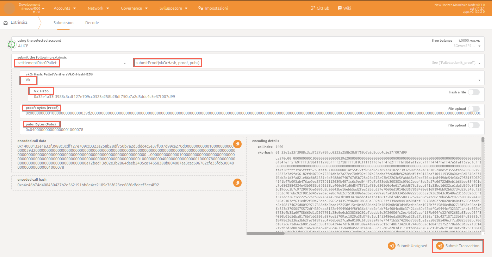

In this tutorial we'll go through the process of submitting and verifying a Risc0 proof to the zkVerify chain.

## Requirements

- A Substrate compatible wallet with funds (ACME) connected to the network.
- A Risc0 proof, together with its corresponding public inputs and verification key; if you don't satisfy this requirement check out [this tutorial](../run-a-zkrollup/risc0_installation) on how to generate them.

## Step 1

Send the proof to zkVerify chain.
In order to do this you can use [PolkadotJs](https://polkadot.js.org/apps/?rpc=wss%3A%2F%2Ftestnet-rpc.zkverify.io#/extrinsics).

- Select your account (you must have some ACME).
- Choose the `settlementRisc0Pallet` and the call `submitProof`.
- Inside the field `vkOrHash` select `Vk` and paste the verification key (i.e. the image id of the code whose execution you want to verify), making sure to prepend it with hexadecimal prefix `0x`.
- Inside the field `proof` paste the proof, making sure to prepend it with hexadecimal prefix `0x`.
- Inside the field `pubs` paste the public inputs, making sure to prepend it with hexadecimal prefix `0x`.
- Click on `submitTransaction`.

## Step 2

Check your transaction on the [zkVerify Block Explorer](https://testnet-explorer.zkverify.io/v0)!
