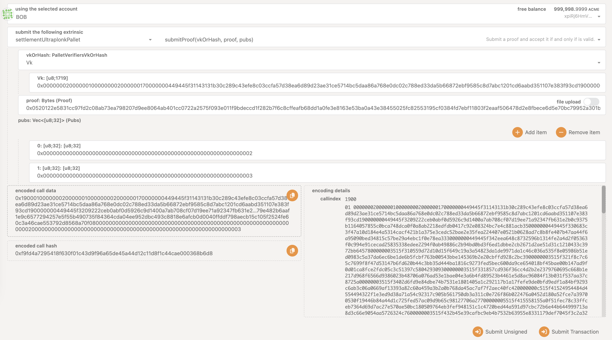

In this tutorial, we will walk through the process of submitting a Ultraplonk proof generated by [Noir](https://noir-lang.org/docs).

> **Note:** Recursive proofs are not supported at this time.

## Requirements

Before starting, ensure you have the following tools installed:

- `noirup`: Follow the installation instructions [here](https://noir-lang.org/docs/getting_started/installation/).
- [`noir-cli`](https://github.com/HorizenLabs/ultraplonk_verifier/tree/v0.1.0?tab=readme-ov-file#bins) tool.
  - git clone https://github.com/HorizenLabs/ultraplonk_verifier
  - git checkout fix/noir-cli-key
  - cargo install --features bins --path .   (Note: This may take 20-25 mins when running for the first time)
  - noir-cli key --input ./resources/proves/verifier.sol --output ./target/vk.bin
  - noir-cli proof-data --input-json ./resources/proves/proof.json --output-proof ./target/proof.bin --output-pubs ./target/pubs.bin
  - noir-cli verify --key ./target/vk.bin --proof ./target/proof.bin --pubs ./target/pubs.bin
- `nargo` version 0.30.0.

## Setting the Nargo Version

To set the correct version of `nargo`, run:

```shell
noirup -v 0.30.0
```

Verify the version with:

```shell
nargo --version
```

## Create a New Noir Project

Refer to the [Noir documentation](https://noir-lang.org/docs/v0.30.0/getting_started/hello_noir/) for instructions on creating a new project and generating proving artifacts. Be sure to use version 0.30.0 of the documentation.

## Generating the Solidity Verifier Contract

Generate the Solidity verifier contract by running:

```shell
nargo codegen-verifier
```

This will create a file named `plonk_vk.sol` in the `./contract/hello_world` directory and a proof file named `hello_world.proof` in the `./target` directory. Your project structure should look like this:

```shell
$ tree
.
├── Nargo.toml
├── Prover.toml
├── Verifier.toml
├── contract
│   └── hello_world
│       └── plonk_vk.sol
├── proofs
│   └── hello_world.proof
└── src
    └── main.nr
```

## Creating the Proof Data JSON File

Create a new file named `proof.json` in your project’s root directory with the following content:

```json
{
  "proof": "0x...",
  "verifyInputs": ["0x..."]
}
```

Replace the `proof` and `verifyInputs` fields with the values from the `hello_world.proof` and `Verifier.toml` files, respectively.

### Generating Proving Artifacts

To generate the proving artifacts, execute the following commands:

```shell
noir-cli key --input ./contract/hello_world/plonk_vk.sol --output ./target/vk.bin
noir-cli proof-data --input-json ./proof.json --output-proof ./target/proof.bin --output-pubs ./target/pubs.bin
```

To make sure the proving artifacts are generated correctly, run:

```shell
noir-cli verify --key ./target/vk.bin --proof ./target/proof.bin --pubs ./target/pubs.bin
```

These commands will generate the necessary files for submitting the Ultraplonk proof.

### Submitting the Proof

Submit the proof by using `polkadot.js.org` frontend like on the image below:


