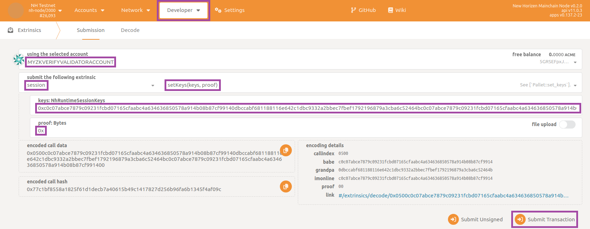
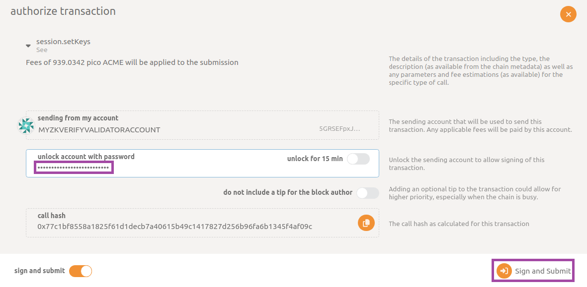
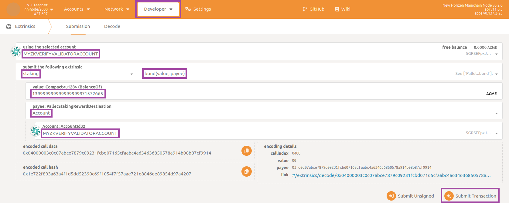
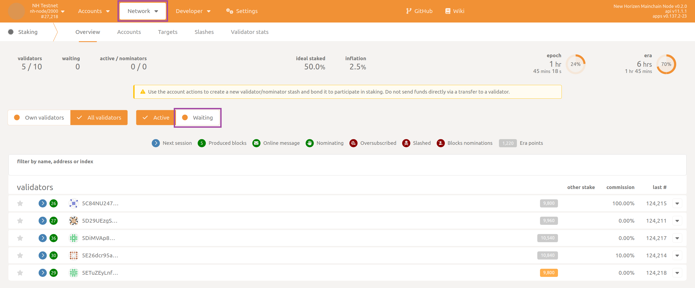
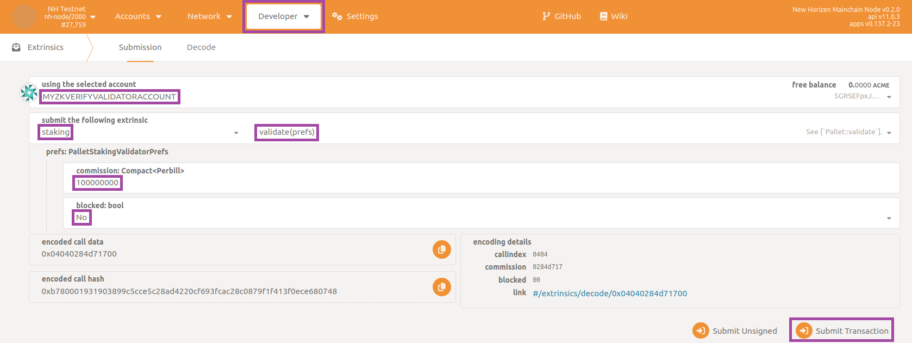
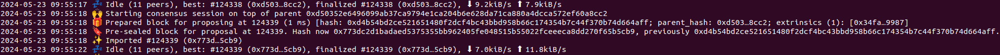

## Prepare the Environment

To run a new validator node (refer to [this page](../01-getting_started.md#node-types.md) for node types) open the terminal and navigate to the root directory of project `compose-zkverify-simplified`:

```bash
cd compose-zkverify-simplified
```

then launch the initialization script by typing:

```bash
scripts/init.sh
```

The interactive session run by the script asks you to provide the following inputs:

- Node type: you need to select validator node,
- Network: currently only testnet is available,
- Node name: just a human readable identifier,
- Node key (`node_key.dat` file): you can import an already existing key or let the script to randomly generate one for you (refer to [this page](./01-getting_started_docker.md) for node keys),
- Secret phrase (`secret_phrase.dat` file): you can import an already existing secret phrase or let the script to randomly generate one for you (refer to [this page](./01-getting_started_docker.md) for secret phrases).

At the end of the session the script will populate directory `deployments/validator-node/`*`network`* with the proper files and you will get the following message:

```bash
=== Run the compose project with the following command:

========================
docker compose -f /home/your_user/compose-zkverify-simplified/deployments/validator-node/testnet/docker-compose.yml up -d
========================
```

Before actually launching the node, you can further inspect and customize the execution by manually editing `deployments/boot-node/`*`network`*`/.env` file. Entries under `# Node miscellaneous` section are related to the Docker container, while those under `# Node config` section are related to the Substrate node instance.

:::warning
Ensure that you fully understand the implications of customizing the execution manually if you choose to do so.
:::

## Run the Node

**Now we'll start running the node.**

Within the terminal type the command below which runs the Docker container:

```bash
docker compose -f /home/your_user/compose-zkverify-simplified/deployments/validator-node/testnet/docker-compose.yml up -d
```

Once this command is complete, your node will begin running in the background.  To ensure that it is running properly, type:

```bash
docker container ls
```

and you should get something similar to:

```bash
CONTAINER ID   IMAGE                            COMMAND                CREATED              STATUS              NAMES
ca4bdf2c6f05   horizenlabs/zkverify:0.2.0-rc1   "/app/entrypoint.sh"   About a minute ago   Up About a minute   validator-node
```

This shows your node has started correctly.

In order to make it eligible for authoring new blocks, you need to follow the below additional steps.

## Next Steps

In this section you can learn how to register a new validator on the blockchain. The operations described below must be performed just once.  They consist of the submission of some extrinsics (transactions, in Substrate terminology) resulting in your node being able to author new blocks and consequently earn new tokens through staking mechanism.

:::note
Since you are going to submit extrinsics which change the blockchain state, you need sufficient funds in the account (uniquely identified by your secret phrase) associated with your validator so that you can pay transaction fees.  
:::

For security reasons, your validator node does not expose an RPC interface but you need a user friendly way for submitting the extrinsics, so the first thing to do is to connect to the public RPC endpoint at this [link to Polkadotjs](https://polkadot.js.org/apps/?rpc=wss%3A%2F%2Ftestnet-rpc.zkverify.io#/explorer).  Refer to [this section](./02-run_new_rpc_node.md#explore-and-interact-with-the-node) for a brief walkthrough.

In order to use PolkadotJS with your validator account, you need to import it within the application.

From here, you can choose any extrinsic you submit with PolkadotJS to use your validator account.

Next, you need to define the session public keys your validator node will use for participation in the consensus (i.e. authoring new blocks and selecting the best chain). This can be achieved by concatenating the three Babe, Grandpa and ImOnline public keys you can derive from your secret phrase. Inside a terminal type this command:

```bash
docker run --rm -ti --entrypoint nh-node horizenlabs/zkverify:latest key inspect --scheme sr25519
```

and provide your validator secret phrase when prompted for (`URI:`), then hit enter.  You should get the following response:

```bash
Secret phrase:       demise trumpet minor soup worth airport minor height sauce legend flag timber
  Network ID:        substrate
  Secret seed:       0x9b6a3ec8063e64e9d896ed8dbcd895d7fd0d7a3a982ed9b6839e2b55c49b9e15
  Public key (hex):  0xc0c07abce7879c09231fcbd07165cfaabc4a634636850578a914b08b87cf9914
  Account ID:        0xc0c07abce7879c09231fcbd07165cfaabc4a634636850578a914b08b87cf9914
  Public key (SS58): 5GRSEFpxJ8rU4LLiGrsnvkk7s1hdJXFZzx1T41KhECzTn7ot
  SS58 Address:      5GRSEFpxJ8rU4LLiGrsnvkk7s1hdJXFZzx1T41KhECzTn7ot
```

Where the `Public key (hex)` represents the Babe key and the ImOnline key.

Repeat the command but change the last parameter:

```bash
docker run --rm -ti --entrypoint nh-node horizenlabs/zkverify:latest key inspect --scheme ed25519
```

and provide same secret phrase when prompted for (`URI:`), then hit enter.  You should get the following response:

```bash
Secret phrase:       demise trumpet minor soup worth airport minor height sauce legend flag timber
  Network ID:        substrate
  Secret seed:       0x9b6a3ec8063e64e9d896ed8dbcd895d7fd0d7a3a982ed9b6839e2b55c49b9e15
  Public key (hex):  0x0dbccabf681188116e642c1dbc9332a2bbec7fbef1792196879a3cba6c52464b
  Account ID:        0x0dbccabf681188116e642c1dbc9332a2bbec7fbef1792196879a3cba6c52464b
  Public key (SS58): 5CNiZaphDhE8gT7cCDNZrXkd6vFfsuPjNQqdS8eEEw8mroHp
  SS58 Address:      5CNiZaphDhE8gT7cCDNZrXkd6vFfsuPjNQqdS8eEEw8mroHp
```

where here, the `Public key (hex)` represents the Grandpa key.

Now you just need to concatenate the three keys respecting this order: Babe, Grandpa and ImOnline. In the example above this would result in: `0xc0c07abce7879c09231fcbd07165cfaabc4a634636850578a914b08b87cf99140dbccabf681188116e642c1dbc9332a2bbec7fbef1792196879a3cba6c52464bc0c07abce7879c09231fcbd07165cfaabc4a634636850578a914b08b87cf9914`

:::note
The hexadecimal prefix `0x` is written just once.
:::

This is the set of session public keys of your validator.

After generating the set of keys, you have to register them in the blockchain, so that they are available to all the nodes in network. You can achieve this by submitting a specific extrinsic through PolkadotJS. Navigate to the section `Developer` then to the subsection `Extrinsics` and select `session`, `setKeys` in the two dropdown panels. Remember to select your validator account as `using the selected account`.   Then fill in the textboxes `keys: NhRuntimeSessionKeys` and `proof: Bytes` respectively with the set of session public keys you just prepared and with empty value `0x`, finally click on `Submit Transaction` button:



Insert your account password and confirm by clicking on button `Sign and Submit`:



In few seconds you should receive a green pop-up message on the top-right corner confirming the extrinsic has been succesfully submitted.

Now that the blockchain knows those public session keys are associated with your validator account, you can proceed by staking some of the tokens you own in order to have a chance to be elected as a validator for the next sessions. To achieve this you have to submit another type of extrinsic.

:::tip
Before doing this, you may want to know what is the current stake of other validators so you can stake a sufficient number of tokens to become an active validator.  The current **zkVerify** implementation requires to be in the **top 10 stakers** in order to be included in the active validators set.
:::

Navigate to the section `Developer` then to the subsection `Chain state`, select `staking`, `erasStakersOverview` in the two dropdown panels, insert current era number (can be obtained querying `currentEra` in the same page) and make sure to disable `include option` flag.  Finally click on `+` button:


The response you get should have a payload similar to this:

```json
[
  [
    [
      0
      5ETuZEyLnfVzQCaDM8aQCcsNnz6xjPKvQCtqynCLqwng8QLd
    ]
    {
      total: 279,999,999,999,999,999,995,132,984
      own: 279,999,999,999,999,999,995,132,984
      nominatorCount: 0
      pageCount: 0
    }
  ]
  [
    [
      0
      5D29UEzgStCBTnjKNdkurDNvd3FHePHgTkPEUvjXYvg3brJj
    ]
    {
      total: 279,999,999,999,999,999,995,132,984
      own: 279,999,999,999,999,999,995,132,984
      nominatorCount: 0
      pageCount: 0
    }
  ]
  [
    [
      0
      5DiMVAp8WmFyWAwaTwAr7sU4K3brXcgNCBDbHoBWj3M46PiP
    ]
    {
      total: 139,999,999,999,999,999,971,572,664
      own: 139,999,999,999,999,999,971,572,664
      nominatorCount: 0
      pageCount: 0
    }
  ]
]
```

In the example above, the third active validator (sorting them from highest to lowest stake) has staked `139,999,999,999,999,999,971,572,664` (unit of measure is `ACME*10^18`) so you are required to stake at least that amount for participating actively.

### Staking

To submit the staking extrinsic, navigate back to the section `Developer` then to the subsection `Extrinsics` and select `staking`, `bond` in the two dropdown panels.  Remember to select your validator account as `using the selected account`, then fill in the textboxes `value: Compact<u128> (BalanceOf)` and `payee: PalletStakingRewardDestination` respectively with the amount of tokens you want to stake (note here unit of measure is `ACME`, not `ACME*10^18`) and the value `Account` followed by selection of your validator account.  Finally, click on `Submit Transaction` button:



Insert your account password and confirm by clicking on button `Sign and Submit`. Wait for a green pop-up message confirming successful submission. As an additional double check you can navigate to the section `Network` then to the subsection `Staking`, click on `Waiting` tab and verify that your validator is within the list:



### Becoming a validator

Now that the blockchain knows you have staked your tokens it's time for the last step.  This involves declaring that you are ready to act as a validator. Navigate again to the section `Developer` then to the subsection `Extrinsics` and select `staking`, `validate` in the two dropdown panels. Remember to select your validator account as `using the selected account`, then fill in the textbox `commission: Compact<Perbill>` with the fraction of the commission you keep if other users delegate their tokens to you by nomination (parts per billion, if you don't know which value to set use `100000000`).  Select `No` in the dropdown panel `blocked: bool` and finally click on `Submit Transaction` button:



Insert your account password and confirm by clicking on button `Sign and Submit`. Wait for a green pop-up message confirming successful submission. As an additional double check you can navigate to the section `Network` then to the subsection `Staking`, click on `Active` tab and verify that your validator is within the list.

## Conclusion

That's it! You just need to wait for the completion of the current era and the next one (since an era lasts for 6 hours, in the worst case this would be 12 hours).  After that your node will start authoring new blocks. You can check this by navigating to the section `Network` then to the subsection `Explorer` for a summarized view of the list of recently authored blocks, or to the section `Network` then to the subsection `Staking` for an advanced console specifically designed for staking. On the Docker side you can check the logs and expect messages like the following one:



reporting your validator node is not only syncing the blockchain but also contributing by authoring new blocks (`Starting consensus session...` and `Pre-sealed block for proposal...`).

If you are interested in how to claim the new tokens you deserve as an active validator, navigate to the section `Developer` then to the subsection `Extrinsics` and select `staking`, `payoutStakers`.  Remember to select your validator account as `using the selected account`, then choose your validator account as `validatorStash: AccountId32` and insert target era in the textbox `era: u32 (EraIndex)`.  Finally click on `Submit Transaction` button:


the era index being retrievable from section `Developer` then to the subsection `Chain state`, state `staking`, `erasRewardPoints`, then filtering with respect to your validator account.

:::warning
You will want to periodically repeat this claim operation (even better to automate it in some way) as the blockchain progresses.  You can only claim rewards for the **previous 30 eras** (approximately one week).
:::
